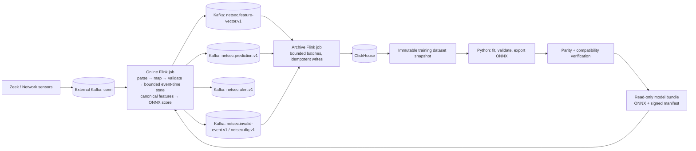

# Network Security ML Platform — Architecture Review and MVP Decision

**Scope:** Kafka `conn` telemetry → Flink feature pipeline → CPU ONNX inference → Kafka outputs → asynchronous ClickHouse archive.  This is designed for two engineers, Java 21/Flink 2.2.1, an external Kafka cluster, and no GPU.

## Executive decision

Implement one **canonical Java feature pipeline** that runs inside Flink for both online scoring and bounded historical backfills. Python must train only from the `FeatureVector` rows materialized by that pipeline; it must not reimplement parsing, normalization, windowing, categorical mapping, defaults, or feature ordering.

The online job publishes durable feature and prediction events to internal Kafka topics. A small, separate archive job writes them to ClickHouse in batches. Therefore ClickHouse is useful for training and investigation but is not a synchronous dependency for a security prediction.

For the MVP, deploy one immutable model bundle with a verified manifest at job startup and release a new model by savepoint/redeploy. Do **not** implement live model hot reload, a feature store, MLflow, Kubernetes, or multi-model routing in the first 20 days.

The architecture cannot pick a valid production ML model until the team defines a label source, prediction target, and business metric. If labelled data is unavailable by the end of week one, ship the feature/prediction plumbing with a clearly marked baseline or rule score—not a falsely claimed ML detector.

---

# Step 1 — Challenge the architecture

| PROBLEM | WHY IT IS A PROBLEM | RECOMMENDED SOLUTION |
|---|---|---|
| “Same preprocessing in Flink and Python” is a goal, not a design. | Two implementations will diverge on nulls, time units, unknown services, window boundaries, and numeric precision. The difference will be silent. | Java/Flink produces every training and serving vector. Python reads those vectors and only fits the model transform/classifier. Keep learned scaling/encoding inside the exported ONNX graph. |
| There is no model objective, label source, alert threshold, or success metric. | Architecture cannot compensate for missing ground truth. An anomaly score, malware label, and incident-priority score have different datasets, evaluation, and false-positive costs. | On day 1, document target, label owner/source, positive-rate expectation, acceptable alert volume, and recall/precision or cost metric. Use time-based validation. |
| The current `NetworkEvent` drops meaningful connection fields. | `missed_bytes`, `local_orig`, `local_resp`, and possibly `history` are already present. Dropping them irreversibly makes future features impossible; a generic map in the domain is equally bad. | Make an explicit `ConnectionDetails` value object for fields accepted into the canonical contract. Keep unapproved source fields only in an optional raw audit record. |
| `DateTime` is assumed to be event time without a contract. | It appears to be epoch seconds, while the source may send missing, future, or clock-skewed values. Bad time creates incorrect windows and unbounded watermark delay. | Specify epoch seconds → UTC milliseconds, reject impossible timestamps, measure skew, and use `receivedAt` only for audit. Ignore `sort_column` as source-specific metadata. |
| The Kafka input has no owned schema/version. | Zeek fields can change type or disappear without a Kafka broker error. A permissive JSON parser can turn a source change into wrong features. | Own `zeek-conn-source-v1` as a compatibility contract. Required-field/type violations go to a compact dead-letter topic; new irrelevant fields are counted and ignored. |
| Putting ClickHouse directly after inference makes it part of the alert path. | Slow inserts, disk pressure, or an unavailable database cause Flink backpressure/restarts and stop detection. | Write predictions and feature vectors to Kafka first. Archive them from a separate consumer job. Kafka output is the online handoff; ClickHouse is an asynchronous analytical sink. |
| “Exactly once into ClickHouse” is often promised but not true. | ClickHouse inserts are not a Flink transactional sink. A crash after insert and before offset/checkpoint acknowledgement yields duplicates. | Make archive records idempotent with stable IDs. Use `ReplacingMergeTree`; deduplicate in training snapshot queries. Keep exactly-once only for Kafka source-to-Kafka output, subject to configured checkpoints. |
| Stateful features are described without a cardinality budget. | `MapState` of IPs, lists of past events, or exact distinct destination sets can exhaust JVM heap or RocksDB. | MVP state is a fixed number of numeric rolling buckets per `(sensor, sourceIp)`, plus a small bounded reorder buffer. No unbounded per-IP map or event history. |
| Event-time features and immediate per-record scoring conflict when records arrive out of order. | Processing in arrival order gives different vectors on replay; waiting indefinitely destroys latency. | Choose a documented bounded disorder allowance (initially 5 s), order by `(eventTime,eventId)` within a bounded buffer, and route late/overflow events aside. This creates a bounded latency/correctness trade-off rather than hiding it. |
| Feature versions can be changed in place. | Reordered arrays, a changed default, or changed unit can make an apparently compatible model wrong. | Feature schemas are immutable and content-hashed. A changed value rule, order, unit, or type creates `conn-v2`; a model accepts exactly one schema hash. |
| Dynamic model reload sounds convenient. | It complicates checkpoint/replay semantics, leaks native ONNX memory, and makes an incident impossible to reproduce. | MVP model is pinned in job configuration and loaded once in `open()`. Release via savepoint/redeploy. Consider controlled hot reload only after audit and rollback automation exist. |
| ONNX export is treated as proof that serving works. | Unsupported operators, changed class-score output, dynamic shapes, and float64/float32 differences are common. | Bundle an ONNX compatibility test: load with the Java ONNX Runtime version used by Flink, assert input/output names/shapes, and compare 10,000 representative vectors with Python within tolerance. |
| No CPU/thread plan exists. | Four Flink subtasks each invoking a multi-threaded runtime oversubscribes eight cores and increases tail latency. | Start with four scoring subtasks and set ONNX intra/inter-op threads to 1. One session is initialized per subtask. Benchmark before enabling batching or more threads. |
| The proposal treats every topic as an immediate scope requirement. | Supporting `dns`, `http`, `ssl`, `ssh`, etc. in one MVP multiplies contracts, joins, labels, and state. | MVP supports only `conn`. Add a new source topic behind a separate source DTO, mapper, contract, fixture set, and schema version. |
| The model registry is unspecified. | A mutable “latest.onnx” makes rollbacks and forensic reconstruction impossible. | Use an immutable, content-addressed bundle directory on a read-only mounted volume for MVP. Artifact bytes, manifest, schema hash, evaluation summary, and SHA-256 are all pinned. |
| Observability is a checklist, not an operational design. | High-cardinality metrics can damage Prometheus; logs without IDs cannot trace a bad prediction. | Use structured logs with correlation IDs, bounded-cardinality metrics, four focused dashboards, and actionable alerts. Never use IP address or event ID as a metric label. |
| Checkpoint storage is not mentioned. | Container-local checkpoints disappear on recreation; recovery then resumes from offsets without state correctness. | Store checkpoints and savepoints on a durable mounted volume or approved object/filesystem storage, not a TaskManager container filesystem. |

## Critical data-model review

`ZeekConnEvent` is correct as an adapter DTO. It is not a domain object and must not escape the Kafka/Flink adapter. The normalized domain event should be a typed, minimal connection fact:

```text
NetworkEvent
  eventId: EventId                    # source id, sensor-namespaced
  eventTime: Instant                  # UTC millisecond precision
  sensor: SensorId
  connection: ConnectionTuple
    sourceIp: IpAddress
    sourcePort: Port
    destinationIp: IpAddress
    destinationPort: Port
    protocol: Protocol                # TCP / UDP / ICMP / OTHER
    service: ServiceCode              # finite known list + OTHER/UNKNOWN
    connectionState: ConnectionState  # finite known list + OTHER/UNKNOWN
  measurements: ConnectionMeasurements
    durationMillis: long
    originBytes: long
    responseBytes: long
    originPackets: int
    responsePackets: int
    missedBytes: long
  locality: ConnectionLocality        # origin/response local flags, when present
```

`EventEnvelope` holds Kafka topic/partition/offset, received time, source schema version, and raw-payload hash for audit. It is deliberately outside the domain. `id` must be stable. If an upstream event lacks one, derive an ingestion id from `(sensor, topic, partition, offset)` and make clear it is a source-record id, not a globally intrinsic network-event id.

Do not default a missing byte count to zero unless `FeatureDefinition` explicitly says so and the model has a matching missingness indicator. Required numeric fields that cannot be safely defaulted are invalid events, not “zero traffic.”

---

# Step 2 — Final architecture



### Data flow and ownership

1. **External Kafka is an input boundary.** The online job consumes only the configured `conn` topic and commits offsets through Flink checkpoints. Broker address, TLS/SASL settings, and topic names are deployment configuration—not Java constants.
2. **The Flink input adapter parses and validates bytes.** It maps a `ZeekConnEvent` to `NetworkEvent` through `EventMapper`; errors are routed to a dead-letter output with reason and a protected/raw hash. No malformed source record can crash the job.
3. **The canonical feature use case creates a versioned `FeatureVector`.** It applies deterministic normalization and fixed-memory temporal state. The direct output is sent both to the in-process inference adapter and to `netsec.feature-vector.v1` for durable archive/training lineage.
4. **The ONNX adapter returns a `Prediction`.** It uses a model already validated at operator initialization. Invalid feature vectors never receive an invented score.
5. **Kafka is the durable online output.** Predictions/alerts are visible even if ClickHouse is unavailable. Consumers use `predictionId` for idempotency.
6. **The archive job is independently restartable.** It consumes internal topics, batches inserts, and writes event, feature, prediction, and quarantine tables to ClickHouse. Archive lag is measurable but does not affect scoring.
7. **Training begins from an immutable dataset snapshot.** The snapshot pins a feature schema hash, time range, label revision, deduplication query, and source table versions. Python does not read raw Kafka to calculate features.
8. **A model release is immutable.** Training writes a complete version directory only after verification. A deployment configuration names its version; the online job is restarted from a savepoint with that exact bundle.

### Domain, application, ports, and adapters

The core runs as normal Java unit-testable code; Flink is a driver, not the application model.

```text
domain
  NetworkEvent, FeatureVector, Prediction, ModelMetadata
  feature formulas, validation rules, rolling-bucket data structures

application
  NormalizeEvent, BuildFeatures, ScoreFeatureVector, ArchiveRecord use cases
  input/output port interfaces and orchestration policies

adapters
  inbound: Kafka bytes/JSON and Flink stream/state driver
  outbound: Kafka producer, ONNX Runtime, file model registry, ClickHouse client,
            Prometheus/logging

bootstrap
  online job and archive job wiring, configuration, lifecycle
```

`domain` has no Flink, Kafka, ClickHouse, ONNX, Jackson, JDBC, or Python dependency. `application` may depend on domain and port interfaces only. Adapters implement ports and are composed in a bootstrap module. Flink keyed state is an adapter concern; the pure domain receives/returns a serializable `SourceWindowState` value.

### Kafka topology

Use the existing external topic only for input. Create internally owned, versioned topics:

| Topic | Key | Retention / purpose | Owner |
|---|---|---|---|
| `netsec.feature-vector.v1` | `eventId` | 7 days; durable archive/training lineage | Platform |
| `netsec.prediction.v1` | `predictionId` | 14 days; prediction handoff and archive input | Platform |
| `netsec.alert.v1` | `predictionId` | 30 days; downstream SIEM/alert consumer | Platform |
| `netsec.invalid-event.v1` | `eventId` or record id | 14 days; semantically invalid input/feature audit | Platform |
| `netsec.dlq.v1` | source record id | 14 days; parse/type/schema failures | Platform |

Use the source record’s upstream ID only after namespacing it with sensor. Use `eventId + modelVersion` for `predictionId`. Set producer idempotence and Flink Kafka sink exactly-once mode where the broker configuration supports transactions. Partition counts must be at least the desired source parallelism; first measure the existing `conn` partition count instead of assuming it. With fewer input partitions, source parallelism cannot exceed that count.

### Training/serving skew prevention — the non-negotiable rule

There are two categories of transformation:

1. **Canonical feature preparation:** parsing, unit conversion, known-category mapping, missing-value policy, rolling window calculations, feature order, and conversion to `float32`. This is Java domain/application code executed by Flink for both live scoring and historical backfill.
2. **Fitted ML transformation:** imputation/scaling or model-owned encoding learned from the training dataset. It is included in the ONNX graph with the estimator, not reimplemented in Java.

Python receives `FeatureVector.values: float32[N]` generated by the canonical pipeline. It can fit a pipeline that accepts exactly `[batch, N]` and export the entire fitted pipeline plus classifier/regressor to ONNX. Avoid high-cardinality categorical encoders in MVP. Known low-cardinality categorical values are already represented as fixed numeric/one-hot features in the canonical schema; unknown is explicit.

Every model bundle contains the exact feature-schema JSON and its SHA-256. At startup the ONNX adapter verifies:

```text
model.expectedFeatureSchemaId == activeFeatureSchema.id
model.expectedFeatureSchemaHash == sha256(active schema bytes)  # 64 lowercase hex characters
model.inputType == FLOAT32
model.inputShape == [dynamic-or-1, featureCount]
model input/output tensor names and expected label semantics are present
artifact SHA-256 and ONNX Runtime compatibility are valid
```

Mismatch is a **fail-fast deployment error**. It never falls back to a different version or silently pads/truncates an array. Any changed formula, default, type, unit, order, bucket rule, or category mapping creates a new feature schema and needs a new model.

Historical training data is generated by running the same compiled feature pipeline in bounded/backfill mode over a pinned Kafka offset/time range. A golden corpus containing normal, null, unknown-category, out-of-order, and late examples is asserted by Java and Python/ONNX parity tests in CI.

---

# Step 3 — Module boundaries

| Module | Responsibility; inputs → outputs | Dependencies / interfaces | Failure behavior | Tests |
|---|---|---|---|---|
| `kafka-zeek-adapter` | Kafka bytes → `ZeekConnEvent` plus envelope | Kafka client, JSON parser; `IncomingEventPort` | Bad JSON/type → DLQ; source outage pauses consumption | JSON fixtures, fuzzed malformed payloads, contract compatibility |
| `event-mapping` | DTO → validated `NetworkEvent` | Domain only; `EventMapper`, `EventValidator` | Required values invalid → invalid-event output; unexpected enumerations → explicit `OTHER` + metric | Unit tests for units, defaults, IP/port ranges, stable IDs |
| `feature-core` | `NetworkEvent` + `SourceWindowState` → `FeatureVector` + new state | Domain only; `BuildFeaturesUseCase` | Cannot produce finite required input → invalid vector, no score | Golden vectors, boundary/window/tie-breaker/property tests |
| `flink-feature-driver` | Reorder, key, load/save state, invoke feature core | Flink adapter and input port | Late/overflow records routed aside; state restore from checkpoint | MiniCluster checkpoint/restart, watermark/idleness tests |
| `onnx-inference-adapter` | `FeatureVector` → `Prediction` | ONNX Runtime; `InferencePort`, `ModelRegistryPort` | Bundle/load/compatibility error fails startup; per-record invalid vector is quarantined | Java runtime load, tensor shape, 10k Python parity vectors, native resource-close test |
| `kafka-output-adapter` | feature/prediction/alert domain events → internal topics | Flink Kafka sink; `PredictionPublisherPort` | Producer failure participates in job checkpoint/restart | Embedded/test Kafka, duplicate and key tests |
| `clickhouse-archive-adapter` | Archive-topic events → ClickHouse batches | ClickHouse client; `ArchivePort` | Database outage grows archive lag/retries; does not stop online job | Container integration test, retry/idempotency/dedup query tests |
| `model-registry-adapter` | immutable deployment/version → verified model bundle | Read-only filesystem initially; `ModelRegistryPort` | Missing/corrupt/mismatched bundle prevents online job start | Hash/manifest/atomic-publish and rollback tests |
| `training` | snapshot rows + labels → evaluated ONNX bundle | Python; ClickHouse reader; training manifest | No labels/quality gate failure means no release | Reproducibility, temporal split, export, parity, model-card checks |
| `observability-adapter` | logs/metrics/health from every module | SLF4J, Flink metrics, Prometheus | Metrics failure must not stop data path | Metric naming/cardinality and readiness tests |

---

# Step 4 — Repository structure

```text
ml-platform/
├── README.md
├── pom.xml                              # Java 21 multi-module parent
├── compose/
│   ├── docker-compose.dev.yml
│   ├── flink-conf.yaml
│   └── prometheus.yml
├── contracts/
│   ├── source/zeek-conn-source-v1.json
│   ├── domain/network-event-v1.json
│   ├── features/conn-feature-schema-v1.json
│   ├── model/model-bundle-manifest-v1.json
│   ├── stream/feature-vector-v1.json
│   └── stream/prediction-v1.json
├── modules/
│   ├── domain/
│   │   └── src/main/java/.../domain/{event,feature,model,inference}/
│   ├── application/
│   │   └── src/main/java/.../application/
│   │       ├── port/in/{NormalizeEvent,BuildFeatures,ScoreFeatures}.java
│   │       ├── port/out/{ModelRegistry,InferenceEngine,PredictionPublisher}.java
│   │       └── usecase/
│   ├── adapter-kafka/
│   │   └── src/main/java/.../{ZeekConnEvent,JsonZeekConnParser,KafkaSinks}/
│   ├── adapter-flink/
│   │   └── src/main/java/.../{Watermarks,ReorderFunction,FeatureProcessFunction}/
│   ├── adapter-onnx/
│   │   └── src/main/java/.../{OnnxModelLoader,OrtInferenceEngine}/
│   ├── adapter-registry-filesystem/
│   │   └── src/main/java/.../FilesystemModelRegistry.java
│   ├── adapter-clickhouse/
│   │   └── src/main/java/.../{ArchiveDeserializer,ClickHouseBatchWriter}/
│   ├── adapter-observability/
│   ├── bootstrap-online-job/
│   │   └── src/main/java/.../OnlineInferenceJob.java
│   └── bootstrap-archive-job/
│       └── src/main/java/.../ArchiveJob.java
├── training/
│   ├── pyproject.toml
│   ├── src/netsec_ml/{dataset.py,train.py,evaluate.py,export_onnx.py,verify.py}/
│   ├── configs/conn-v1-baseline.yaml
│   ├── tests/{test_snapshot.py,test_export.py,test_onnx_parity.py}/
│   └── model_cards/
├── tests/
│   ├── fixtures/{zeek_conn,feature_golden,onnx_parity}/
│   ├── integration/{testcontainers,flink-minicluster}/
│   └── e2e/
├── scripts/
│   ├── submit-online-job.sh
│   ├── run-backfill.sh
│   ├── create-topics.sh
│   ├── build-training-snapshot.py
│   ├── verify-model-bundle.sh
│   └── benchmark-inference.sh
├── models/                               # ignored by Git; mounted read-only at runtime
│   └── conn-risk/<version>/{model.onnx,model-manifest.json,feature-schema.json,sha256sums.txt}
└── docs/
    ├── adr/{001-canonical-features.md,002-async-clickhouse.md,003-pinned-model-release.md}
    ├── runbooks/{kafka-lag.md,checkpoint-failure.md,archive-lag.md,model-rollback.md}
    ├── contracts.md
    ├── performance-baseline.md
    └── model-release-checklist.md
```

`contracts/features/conn-feature-schema-v1.json` is a reviewed, language-neutral artifact. Its source-control change is mandatory for any schema change. Java loads/build-validates generated constants from it at build time; Python packages a byte-identical copy in the model bundle. Do not let each language maintain a hand-written enum.

---

# Step 5 — Contracts

| Boundary | Contract, version, and ownership | Validation and compatibility |
|---|---|---|
| Kafka → Flink | `zeek-conn-source-v1`; source team owns producer shape, platform owns consumer compatibility profile. JSON has stable `id`, `DateTime` epoch seconds, sensor, tuple, and measurements. Kafka metadata stays in envelope. | Strict types/ranges for required fields; unknown additive fields tolerated and counted; removal/type/unit change is a new source version. Invalid messages go DLQ with reason. |
| Flink → domain | `ZeekConnEvent` maps to in-memory `NetworkEvent v1`; platform owns both. | Mapper has no Kafka dependency. Domain validation enforces UTC time, finite/nonnegative counters, IP/port validity, and enums. A new canonical meaning is a new domain mapper/schema version. |
| Domain → feature pipeline | `NetworkEvent` plus `SourceWindowState` → `FeatureVector(schemaId, schemaHash, eventId, eventTime, values: float32[N], qualityFlags)`. Feature team owns definitions; platform owns execution. | Schema lists index/name/type/unit/formula/missing/default/bounds/state requirements. `N`, order, `float32`, finite values, and hash are asserted before model invocation. Breaking change means new ID/version. |
| Feature pipeline → ClickHouse | `feature-vector-v1` Kafka record becomes a CH row; archive owns mapping. | Stable event/schema hash and row id. Archive only commits source progress after a successful batch. Duplicates are expected and query-deduplicated. CH columns may add nullable fields; changing semantics creates stream v2. |
| Feature pipeline → model | Tensor `input: float32[batch,N]`, feature schema hash, deterministic ID. Model bundle owns expected `N`, input name, output names, and label semantics. | Startup validation pins one exact schema hash. Per-record finite check. Never fill, reorder, or cast a feature silently. |
| Model → prediction | `prediction-v1`: `predictionId`, `eventId`, event time, model name/version/SHA, schema hash, score, decision, threshold, quality flags, inference micros. Platform owns it. | `predictionId = hash(eventId, modelVersion)`; score must be finite and bounded according to model manifest. Additive nullable fields are compatible. |
| Training → ONNX | `model-bundle-manifest-v1`: ONNX bytes, immutable version, SHA-256, schema bytes/hash, input/output contract, algorithm/package versions, dataset snapshot hash, labels, metrics, threshold, release time. AI engineer owns release; software engineer owns loader compatibility. | Export refuses mismatched feature count/dtype. CI loads ONNX in the production Java runtime and compares held-out vectors with Python. Compatibility or quality-gate failure blocks publication. |
| Model registry → Flink | `ModelRegistryPort.resolve(deployment)` returns a read-only version directory. The deployment specifies model name and exact version, never `latest`. | Verify all manifest hashes before source consumption. The job records bundle/version/hash in startup logs and every prediction. Rollback means change config to previous immutable version and redeploy from savepoint. |

The deployment configuration must contain model name, exact model version, and the expected manifest SHA-256. It must never resolve `latest`; the registry adapter verifies the pinned manifest, model artifact, and copied feature schema before the source consumes a record.

### Example feature and prediction contracts

```json
{
  "schemaId": "conn-feature-v1",
  "schemaHash": "sha256:…",
  "eventId": "worker-1-4:d83201c5-9039-41c4-8b80-26c9ba09d90a",
  "eventTime": "2026-08-03T…Z",
  "values": [7693.946, 51.0, 0.0, 6.0, 4.0, 5.0, 21.0, 0.0],
  "qualityFlags": 0
}
```

The example values above are illustrative; the schema controls their actual positions. In the real wire contract, `schemaHash` is the 64-character lowercase hexadecimal SHA-256 value without a prefix. A vector array without schema ID and hash is invalid data.

---

# Step 6 — Feature system

## Definitions

```text
FeatureDefinition
  index, name, dtype=float32, unit, formula, missingPolicy,
  validRange, stateRequirement, schemaVersion

FeatureSchema
  id, semanticVersion, contentHash, ordered FeatureDefinitions,
  sourceContractVersion, generatedAt

FeatureVector
  eventId, eventTime, sensor, schemaId, schemaHash,
  values: float32[N], qualityFlags

Preprocessor
  validates and canonicalizes a NetworkEvent; no learned statistics

FeatureExtractor
  computes event features and fixed-window features from a validated event/state
```

For an initial `conn-feature-v1`, keep N small (roughly 12–20) and explain every feature. Examples are duration in milliseconds, origin/response bytes and packets, missed bytes, total bytes, known protocol flags, destination-port class, source connection count over the prior five minutes, source byte sum over the prior five minutes, and source failed-connection count over the prior five minutes. Do not add “interesting” features merely because the raw JSON happens to contain them.

### Stateful feature semantics

- **Key:** `SourceKey(sensor, sourceIp)`. This gives source-behavior features. Do not attempt source, destination, service, and pair state in the MVP; every independent keying dimension adds repartitioning and state.
- **Time:** `NetworkEvent.eventTime` is event time. Start with a 5-second out-of-orderness allowance and 30-second source idleness. Measure timestamp skew and tune from the p99, not intuition.
- **Ordering:** buffer events per key until the watermark permits them, then process by `(eventTime,eventId)`. The buffer has an explicit maximum. A late event (timestamp below the current watermark) is emitted to `invalid-event` with `LATE_EVENT`; it does not mutate state. This makes backfill and live semantics reproducible.
- **Window:** use a fixed-size circular state of one-minute numeric buckets representing the prior five-minute range. The exact bucket membership convention belongs in the feature manifest and golden tests. This is bounded and intentionally approximate; it is vastly safer than retaining event lists.
- **State:** `SourceWindowState` contains six bucket totals/counters, last bucket start, and no sets of destination IPs. The short reorder buffer is separately bounded. State TTL starts at 30 minutes after inactivity, subject to measurement. A new source begins with explicit zero-history flags/values as specified in the schema.
- **Memory controls:** cap reorder records and serialized bytes per key, reject/flag overflows, monitor active keys/state bytes, and prohibit `ListState`/`MapState` without an approved cardinality bound. Use the EmbeddedRocksDB state backend initially to keep key growth out of JVM heap; set a managed-memory cap and alert long before disk/compaction pressure is critical.
- **Determinism:** inputs, watermark allowance, key, bucket boundaries, tie-breaker, missing policy, and output `float32` conversion are part of the schema. Golden tests include late and equal-timestamp events. Exact replay still requires the same source event timestamps and contract—not merely the same logical traffic.

There is no magic way to provide both zero wait and deterministic event-time windows for arbitrarily late input. If the security SLO later requires sub-second decisions, introduce a separately named processing-time feature schema and accept its weaker replay semantics; do not disguise it as the same schema.

### Skew control test gate

CI must run all of the following before a model is releasable:

1. Java unit tests generate expected vectors from source fixtures.
2. A Flink MiniCluster test verifies the same vectors through keying, watermarks, checkpoint restore, and an out-of-order sequence.
3. A bounded backfill writes feature vectors to a test ClickHouse/Kafka environment; Python reads those rows unchanged.
4. Python trains/exports the model and saves Python expected scores for a fixed vector corpus.
5. Java ONNX Runtime reads the same corpus and matches outputs within the model-defined tolerance.
6. A startup test deliberately supplies the wrong schema hash/count and proves the job fails before consumption.

---

# Step 7 — Model system

```text
MLModel             immutable executable model interface
ModelMetadata       model/version/SHA/schema/IO/labels/threshold/metrics/provenance
ModelVersion        immutable release identifier, e.g. 2026.08.15+<short SHA>
ModelRegistry       resolves an exact read-only bundle
ONNXModelLoader     validates manifest + hash, creates runtime session in open()
InferenceEngine     converts one FeatureVector to [1,N] float32 and invokes ONNX
Prediction          versioned score/decision/audit value object
```

Use a CPU-friendly tabular model first. A logistic-regression baseline is valuable because conversion and explanation are simple. If evaluation proves it necessary, use a small histogram/tree-based model whose ONNX conversion and Java runtime outputs pass the same parity gate. Do not choose an algorithm by novelty. Cap an MVP artifact at 50 MB (preferably far smaller); larger models need an explicit measured exception.

### Model bundle

```text
models/conn-risk/2026.08.15+ab12cd34/
  model.onnx
  model-manifest.json
  feature-schema.json
  evaluation.json
  sha256sums.txt
```

The manifest contains artifact SHA-256, model/feature versions and hashes, expected `float32[N]` input, tensor names, ONNX opset/runtime compatibility, class/score interpretation, threshold, training code commit, dependency lock hash, dataset snapshot hash, time split, and quality metrics. Deployment configuration pins the manifest SHA-256 as well as the version; registry write access is restricted and runtime mounts artifacts read-only. Publishing is atomic: write and verify a temporary directory, then publish a new immutable directory.

### Runtime behavior and CPU efficiency

- Create one `OrtEnvironment` per JVM and one `OrtSession` per scoring subtask in `open()` for the MVP. Close sessions/results in `close()`/per-record scope. This is simple and limits native-object leaks. Evaluate a shared/session pool only after concurrency tests prove it safe and beneficial.
- Configure ONNX Runtime intra-op and inter-op threads to **1** initially. With four scoring subtasks, parallelism comes from Flink rather than nested native thread pools.
- Run one-record inference initially: the tensor is `[1,N]`. This meets low-latency security use cases and avoids queueing. Do not micro-batch until benchmark results show that model invocation, rather than state/Kafka, is the bottleneck. If added, cap at 32 records or 5 ms and make timeout metrics mandatory.
- Reuse small `float[]`/buffers where the API safely permits it, keep values as `float32`, avoid JSON serialization between feature and inference operators, and close `OnnxTensor`/`Result` promptly.
- Model initialization happens before the source is allowed to process data. Model load, schema mismatch, missing output, corrupt ONNX, or native runtime failure is a deployment failure, not a per-event retry.

**Release lifecycle:** train → offline validation → ONNX export → Java compatibility/parity → immutable bundle → deployment config change → savepoint → job redeploy → smoke test → observe. MVP rollback is the prior bundle/config plus savepoint redeploy. This is safer and sufficiently fast for a two-person team.

---

# Step 8 — ClickHouse design

ClickHouse is an archive and training-query system. It is not an online model registry or request/response feature store. The archive job makes bounded inserts: flush at **5,000 rows, 4 MiB serialized payload, or 1 second**, whichever arrives first. Those are initial values to benchmark. Keep retry queues bounded; archive failure should create Kafka lag, not unbounded RAM use.

| Table | Core columns and types | Partition / ordering | TTL and write pattern |
|---|---|---|---|
| `network_events` (optional audit) | `event_id String`, `event_time DateTime64(3,'UTC')`, `ingested_at DateTime64(3,'UTC')`, `sensor LowCardinality(String)`, `src_ip IPv6`, `src_port UInt16`, `dst_ip IPv6`, `dst_port UInt16`, protocol/service/state `LowCardinality(String)`, counters `UInt64`, `duration_ms UInt64`, `quality_flags UInt32`, `row_version DateTime64(3)` | `PARTITION BY toYYYYMMDD(event_time)`; `ORDER BY (sensor,event_time,event_id)`; `ReplacingMergeTree(row_version)` | 14 days initially; append batches from archive job. Enable only if raw/normalized investigation need justifies disk. |
| `feature_vectors` | event/audit columns, `schema_id LowCardinality(String)`, `schema_hash FixedString(64)`, `values Array(Float32)`, `quality_flags UInt32`, `row_version DateTime64(3)` | daily partition; `ORDER BY (schema_hash,event_time,event_id)`; `ReplacingMergeTree(row_version)` | 90 days initially; append-only archive writes. Training snapshot query selects one latest row per event id/schema. |
| `predictions` | `prediction_id FixedString(64)`, `event_id String`, `event_time`, `model_name LowCardinality(String)`, `model_version LowCardinality(String)`, `model_sha FixedString(64)`, `schema_hash FixedString(64)`, `score Float32`, `decision UInt8`, `threshold Float32`, `inference_us UInt32`, `quality_flags UInt32`, `created_at`, `row_version` | monthly or daily partition based on measured volume; `ORDER BY (model_name,model_version,event_time,event_id)`; `ReplacingMergeTree(row_version)` | 180 days initially; append prediction records. Never assume immediate physical deduplication. |
| `invalid_events` | record/event IDs, receive/event times, `stage LowCardinality(String)`, `reason_code LowCardinality(String)`, source/schema version, raw payload hash, optional redacted sample, `created_at` | monthly partition; `ORDER BY (stage,created_at,event_id)` | 30 days; low-volume forensic/quarantine batches. |
| `model_releases` | model/version/hash, schema hash, dataset hash, code hash, metrics JSON/String, threshold, released by/time, status | `ORDER BY (model_name,model_version)` | No short TTL; small audit table. It is an audit mirror, not artifact storage. |

Use `DateTime64(3, 'UTC')` everywhere. Use `IPv6` so IPv4 is consistently mapped. Do not create a column per model feature in the MVP; the ordered `Array(Float32)` plus immutable schema is compact and matches the model contract. Add selected named derived columns later only if analysts demonstrate recurring query needs.

`ReplacingMergeTree` makes duplicate ingestion eventually compact; it is not an immediate uniqueness constraint. Training snapshot SQL must explicitly deduplicate by stable event/schema key (for example `argMax(values, row_version)` grouped by event ID and schema hash) and record that SQL plus result checksum in the snapshot manifest. Calculate storage from observed compressed bytes/event × events/sec × retention before committing TTL values. IP-bearing tables require least-privilege ClickHouse users and a documented retention approval.

---

# Step 9 — Flink design

## Jobs and operators

**Online job**

```text
KafkaSource<byte[]>
  → JSON parse / source validation
  → EventMapper + domain validation
  → assign event-time watermarks
  → keyBy(SourceKey(sensor, sourceIp))
  → bounded reorder + rolling feature ProcessFunction
  → in-process ONNX inference
  → KafkaSink(feature-vector, prediction, alert, invalid/DLQ side outputs)
```

Fuse parse/map/validation/feature/scoring through normal operator chaining where parallelism and resource profile agree. Keep the Kafka source and sink as normal boundaries. Do not break chains merely to make the graph look architectural; only unchain after a profile shows a CPU or backpressure reason.

**Archive job**

```text
KafkaSource(feature-vector, prediction, invalid-event)
  → deserialize + route
  → bounded batch writer
  → ClickHouse
```

Run it independently so ClickHouse failure cannot restart the online job.

## Initial deployment values — benchmark, do not canonize

| Setting | Initial value | Why / adjustment trigger |
|---|---:|---|
| Online job source and feature/inference parallelism | 4 | Fits four scoring workers within the host budget. Set source parallelism no higher than `conn` partitions; scale only from observed CPU/lag. |
| Task slots | 4 in one TaskManager for MVP | Simple first deployment. A TaskManager failure causes checkpoint restore; add a second TM only after recovery/throughput need is measured. |
| `maxParallelism` | 128 | Leaves future key-group rescaling room without changing state identity. |
| Watermark disorder allowance | 5 s | Explicit latency/correctness trade-off; tune from source-skew percentile. |
| Idle partition timeout | 30 s | Prevents an inactive partition from indefinitely holding the global watermark. |
| Rolling state | six 1-minute numeric buckets/key; 30-minute TTL | Bounded source behavior context; measure active key count and TTL impact. |
| State backend | EmbeddedRocksDB, managed memory cap 2 GiB | Protects heap from cardinality. Revisit only after measured state/CPU benchmark. |
| Checkpoint interval / min pause | 30 s / 10 s | Acceptable replay window with small state; reduce only if RPO requires it and checkpoint cost permits. |
| Checkpoint timeout / concurrency | 2 min / 1 | Avoid overlapping checkpoint pressure in MVP. |
| Retained checkpoints | 3 externalized, durable storage | Enables diagnosis/savepoint recovery without container-local loss. |
| Restart strategy | failure-rate: 3 failures per 10 min, 10 s delay | Avoids hot-looping a broken deployment; page after repeated failure. |
| Kafka output | exactly-once/checkpointed when supported | Durability of online outputs; verify broker transaction settings in integration test. |
| ClickHouse archive batch | 5,000 rows, 4 MiB, or 1 s | Efficient columnar writes while bounding latency/memory. |

### Error handling

- **Malformed JSON / required source type invalid:** DLQ, count, continue.
- **Domain invalid / impossible timestamp / invalid port:** `invalid-event`, count, continue.
- **Late or reorder-buffer overflow:** `invalid-event` with reason and investigate; do not contaminate state with undocumented semantics.
- **Invalid vector/non-finite tensor input:** no model call; `invalid-event` and alert on rate.
- **Kafka source outage:** job naturally waits/reconnects; monitor lag and broker/client errors.
- **Kafka output failure/checkpoint failure:** job retries according to restart strategy, preserving source-to-output semantics as configured.
- **ClickHouse failure:** only archive job retries/backpressures; online job continues publishing Kafka outputs.
- **Model load/schema failure:** fail deployment before consumption. A currently healthy deployed job remains pinned until an explicit replacement is started.
- **OOM / RocksDB disk pressure:** fail/restart is not a capacity strategy. Alert at 70/85% memory/disk, bound state first, then reduce state/scale infrastructure after a capacity decision.

For an MVP on Docker, durable checkpoint/savepoint volumes and automatic container restart are required. Full JobManager high availability, multiple clusters, and cross-region recovery are not required in the first 20 days.

---

# Step 10 — Observability

Use structured JSON logs, Flink’s Prometheus reporter, Prometheus, Grafana, and Alertmanager. Add cAdvisor/node exporter (or equivalent container/host metrics) and scrape ClickHouse/Kafka JMX/system metrics. Do not add ELK, distributed tracing infrastructure, or a commercial APM in the MVP.

| Signal | Required metrics/log fields | Alert / dashboard |
|---|---|---|
| Host and containers | CPU throttle/use, RSS, JVM heap/non-heap/direct memory, disk free/IO, network errors | **Runtime capacity** dashboard; warn 70%, critical 85% sustained memory/disk; CPU saturation with lag alerts |
| Kafka | consumer lag by topic/partition, records/s, bytes/s, rebalance/client errors, producer failures | **Ingestion/output** dashboard; lag rising for 10 min or error rate >0 page/warn by severity |
| Flink | records in/out, busy/idle/backpressured time, checkpoint duration/failure, restart count, state size, RocksDB compaction, watermark lag | **Online job health** dashboard; two checkpoint failures, sustained backpressure, or increasing watermark lag alert |
| Feature pipeline | parse/domain/late/overflow/invalid counts, feature latency, active keys, schema hash | **Data quality** dashboard; invalid/late/unknown-category rate above baseline alerts |
| ML | model/version/schema hash gauge, inference p50/p95/p99, errors, predictions/s, score buckets, decision rate | **Model serving** dashboard; any model load/error, p99 SLO breach, abrupt score/decision distribution shift alert |
| ClickHouse archive | archive topic lag, batch rows/latency, retries/failures, insert rate, table bytes/parts | **Archive/retention** dashboard; archive lag/insert failure or storage growth threshold alert |

Every log emitted after mapping carries `eventId` or `predictionId`, sensor, stage, model version, schema hash, and reason code where safe. Do not emit raw payloads or IP addresses indiscriminately. Metrics labels are restricted to bounded values such as topic, stage, reason code, model version, schema version, and task—not event ID, IP, port, or arbitrary error text.

Health endpoints/readiness must show: job running, current model bundle validated, last successful checkpoint, input/output connectivity status, and archive status separately. Archive unhealthy must be visible but must not mark online inference unavailable.

---

# Step 11 — Resource budget

These are deployment caps for the stated hardware, not claims of achieved throughput. Establish a representative replay benchmark and report records/s, p50/p95/p99 end-to-end latency, max lag, state size, and CPU before production volume is accepted.

## Inference host: 8 CPU / 32 GiB RAM

| Allocation | CPU cap | Memory cap | Notes |
|---|---:|---:|---|
| Online Flink JobManager + TaskManager | 4 | 14 GiB | Four scoring slots. Roughly 4 GiB JVM heap, 2 GiB RocksDB managed state, 0.5–1 GiB network/direct/native/ONNX, with JVM/process headroom. Set concrete Flink process-memory options rather than only `-Xmx`. |
| ClickHouse archive/storage | 2 | 8 GiB | Same-host only if necessary; cap query/insert memory. ClickHouse remains outside scoring path. |
| Archive job/client | 1 | 2 GiB | Can be colocated only after measurement; reduce/relocate before stealing online capacity. |
| OS, Docker, exporters, safety headroom | 1 | 8 GiB | Do not allocate all 32 GiB to JVMs. External Kafka is assumed; a local dev broker needs a separate cap. |

An MVP ONNX model is capped at 50 MB artifact size. With one session per scoring subtask, reserve at least 4× the artifact size plus native overhead; that is still small relative to the Flink process budget, but native allocation must be measured. State is the likely memory risk, not a small tree/linear model. The cardinality test must estimate `active source keys × serialized state bytes` at peak; stop and redesign if it approaches the 2 GiB state cap.

## Training host: 32 CPU / 64 GiB normal, 128 GiB maximum

| Allocation | 64 GiB normal | 128 GiB maximum | CPU plan |
|---|---:|---:|---|
| Python feature loading/training process | cap 40 GiB | cap 96 GiB | Start 20–24 training threads; reserve cores for extraction/OS. Set BLAS/OpenMP/XGBoost thread counts explicitly to prevent oversubscription. |
| ClickHouse/query/export or local staging | 8 GiB | 16 GiB | Read vectors in chunks and write Parquet/snapshots; never load the entire training history into pandas. |
| OS, filesystem cache, validation | 16 GiB | 16 GiB | Keep headroom for ONNX conversion and parity corpus. |

At 128 GiB, scale dataset extraction/chunking only after the normal-memory pipeline is reproducible. More RAM should not excuse an unbounded pandas dataframe. Persist snapshot metadata, row counts, deduplication rule, label revision, and hash. Model candidate parallelism is constrained by CPU memory; do not launch many candidates concurrently on the same 32 cores.

---

# Step 12 — 20-working-day implementation plan

Engineer A is the AI engineer; Engineer B is the software engineer. “Shared” is deliberately short and scheduled—the handoff artifacts are contracts and fixtures, not oral agreements.

| Day | Engineer A | Engineer B | Shared work / deliverable | Tests and Definition of Done | Dependencies |
|---:|---|---|---|---|---|
| 1 | Define prediction target, labels, metric, alert cost, and acceptance gate. | Inspect `conn` partitions, field presence/types/time skew; record environment limits. | Approve MVP ADRs and latency/retention assumptions. | Contract decision signed; if labels absent, explicit data-collection fallback. | Kafka access |
| 2 | Draft `conn-feature-v1` candidates, units, null/category policies. | Create Maven modules, compose config, secrets/config skeleton, topic naming. | Source/domain/schema contract v1 and 20+ real sanitized fixtures. | Build/test harness runs; contracts reviewed. | Day 1 |
| 3 | Define golden expected vectors for event-level fixtures. | Implement `ZeekConnEvent`, envelope, mapper, domain value objects/validation. | DTO-to-domain boundary complete. | Mapper units include malformed/time/port/unknown enum cases. | Day 2 |
| 4 | Specify rolling-bucket formula, tie rule, quality flags. | Implement pure preprocessor, feature core, schema hash validation. | Canonical feature v1 library. | Golden feature tests pass with float32 values. | Day 3 |
| 5 | Review feature usefulness/leakage and initial label join plan. | Implement Flink source, watermarks, bounded reorder/keyed state, side outputs. | Running feature-only online job to Kafka. | MiniCluster tests: ordering, late event, TTL, checkpoint restore. | Day 4 |
| 6 | Profile training data availability/labels; define temporal split. | Create internal topics and archive job skeleton; durable checkpoint/savepoint volume. | Feature vectors arrive in ClickHouse asynchronously. | Archive failure does not stop online job; dedup query verified. | Day 5 |
| 7 | Build immutable dataset-snapshot tool/query and initial data-quality report. | Finish CH DDL, batched writer, retention/config/runbook. | First pinned snapshot manifest. | Chunked read, row count/hash, schema hash and dedup tests. | Day 6 |
| 8 | Train reproducible baseline; record metric and calibration. | Build filesystem registry adapter and model-bundle manifest validator. | Baseline evaluation/model card. | Temporal validation, deterministic seed, manifest tests. | Day 7 |
| 9 | Export complete fitted pipeline to ONNX; make parity corpus. | Add ONNX Runtime adapter/load/configuration and native resource cleanup. | First loadable ONNX bundle. | Java loads production artifact; shape/dtype/hash mismatch tests. | Day 8 |
| 10 | Compare Python and Java ONNX predictions; tune threshold from agreed metric. | Wire in-process inference and prediction/alert Kafka sinks. | End-to-end score on `conn` fixture. | 10k-vector parity tolerance passes; prediction IDs stable. | Day 9 |
| 11 | Investigate false positives/negatives and feature data quality. | Add savepoint deployment, pinned model config, rollback script. | Release procedure v1. | Bad bundle refuses startup; previous bundle rollback rehearsal. | Day 10 |
| 12 | Add training release checklist and CI export gate. | Add structured logging, Prometheus metrics, health/readiness status. | Four initial Grafana dashboards. | Metric/cardinality tests; model/schema shown in prediction audit. | Day 10 |
| 13 | Validate score/decision distribution on replay. | Add DLQ/invalid event policies and alert rules. | Data-quality and operational runbooks. | Malformed, late, invalid-vector paths verified without job failure. | Day 12 |
| 14 | Define replay benchmark dataset and expected quality report. | Benchmark 1/2/4 parallelism, ORT threads, state sizes, Kafka sink settings. | Performance baseline. | Report records/s, p95/p99, CPU/RAM, lag, state; selected values documented. | Day 10 |
| 15 | Assess label drift/data coverage and release gate result. | Failure drills: Kafka interruption, CH outage, TM restart, checkpoint restore. | Fault-tolerance evidence. | Online predictions continue during CH outage; no silent model/schema fallback. | Days 11–14 |
| 16 | Retrain from pinned snapshot if feature corrections are needed. | Tune retention/TTL/batch values from measured volume; resource caps. | Candidate MVP release bundle. | Capacity calculation and model quality gate pass. | Days 14–15 |
| 17 | Review model card, threshold, limitations, incident workflow. | Security/config review: secrets, read-only model mount, DB ACLs, log redaction. | Production readiness checklist. | No credentials in repo; artifact hashes recorded. | Day 16 |
| 18 | Execute independent training-to-serving reproducibility run. | Execute clean environment deploy from scripts/compose. | Rehearsed release. | Same snapshot/code creates verifiable bundle; clean deploy restores state. | Day 17 |
| 19 | Demo detection output and document known model limits. | Soak test/replay; fix only release blockers. | Go/no-go report. | Sustained benchmark and dashboards/alerts work. | Day 18 |
| 20 | Sign model/feature release evidence or declare label/model blocker. | Sign deployment/runbook/rollback evidence. | MVP demonstration and backlog for Phase 2. | All acceptance tests, recovery drill, and documented residual risks complete. | Day 19 |

The most important day-1 dependency is labels. If it fails, days 8–10 still validate the ONNX plumbing with a sanctioned baseline, but the result must be described as platform MVP/data collection—not as validated security ML.

---

# Step 13 — MVP versus future

## MVP — must ship now

- One source: external Kafka `conn`; one strict source contract and adapter DTO.
- One normalized `NetworkEvent` and immutable `conn-feature-v1` schema with a small, bounded source-IP rolling state.
- One online Flink job and one independent Kafka-to-ClickHouse archive job.
- Internal versioned Kafka topics, DLQ/invalid event path, durable checkpoints/savepoints, and documented restart behavior.
- One CPU-friendly, pinned ONNX model bundle with startup validation, Python/Java parity gate, and savepoint/redeploy rollback.
- ClickHouse feature/prediction/archive tables with explicit TTLs, batch inserts, and snapshot deduplication.
- Prometheus/Grafana/Alertmanager, structured logs, four dashboards, runbooks, replay benchmark, and recovery drill.

## Phase 2 — after MVP evidence

- Add `dns`/`http`/`ssl` through separate source contracts and new versioned features; do not bolt their fields into `conn-v1`.
- Add carefully bounded destination/pair features, approximate distinct counters, better label feedback, drift analysis, and scheduled retraining.
- Add a controlled model promotion workflow, artifact object storage, more TaskManagers, higher availability, and a separately tuned archive deployment.
- Add a selected analyst-friendly feature projection/table only after query patterns are understood.

## Phase 3 — only at demonstrated scale

- Kubernetes or an orchestrator, multi-cluster/high-availability Flink, object-store checkpoints, and multi-region recovery.
- Multi-model routing/canaries, controlled hot model reload, dedicated model serving only if in-process ONNX becomes a measured limitation.
- A feature store, schema registry service, distributed training, or GPU infrastructure only if their operational cost is justified by real throughput/model requirements.

---

# Step 14 — FINAL ARCHITECTURE DECISION

1. **Architecture:** an online Flink feature-and-score job consumes `conn`, emits durable internal Kafka feature/prediction/alert records, and a separate archive job writes ClickHouse. Python trains from immutable archived feature-vector snapshots and publishes an immutable ONNX bundle.
2. **Technology choices:** retain Kafka, Flink 2.2.1/Java 21, ClickHouse, Python, and ONNX Runtime Java. Add only Prometheus/Grafana/Alertmanager and a read-only filesystem registry volume for the MVP.
3. **Major design decisions:** canonical Java feature logic; `float32` feature vectors with immutable content-hashed schemas; fitted transforms packaged in ONNX; bounded event-time source state; ClickHouse removed from critical path; model version pinned at startup; savepoint/redeploy releases.
4. **Rejected alternatives:** duplicate Python feature extraction, direct synchronous ClickHouse inference sink, mutable `latest.onnx`, generic domain maps, unbounded per-IP state, immediate multi-topic support, live model hot reload, Kubernetes/MLflow/feature-store adoption in the MVP.
5. **Reasons for rejection:** each adds silent skew, latency/failure coupling, memory risk, or operational load that two engineers cannot safely carry in 20 days.
6. **Biggest risks:** absence or poor quality of labels; unknown source timestamp/order and active-IP cardinality; uncontrolled input schema changes; an unmeasured CPU/latency budget; and ClickHouse storage volume. None should be hidden by architecture.
7. **Next implementation step:** spend day 1 validating the real `conn` schema/partitioning/time skew and agreeing on the label/metric contract. Then commit `zeek-conn-source-v1.json`, `network-event-v1.json`, and `conn-feature-schema-v1.json` with sanitized golden fixtures before writing the Flink job.
