# Pilot Architecture — Multi-Protocol Cascade Detection

**Status:** design document, no code yet. Extends [`FINAL_ARCHITECTURE.md`](./FINAL_ARCHITECTURE.md) (which remains valid for the `conn`-only, single-model MVP) to the next milestone: four Zeek protocols and a two-stage detection cascade. This document does not replace `FINAL_ARCHITECTURE.md` — it reuses every principle in it (hexagonal layering, immutable content-hashed contracts, Kafka-first durability, ClickHouse off the critical path, immutable model bundles, fail-fast startup validation, "benchmark, do not canonize") and applies them to a wider surface.

**Ultimate goal (not built now):** enterprise deployment ingesting many Zeek protocols at 800 MB/s.
**Pilot scope (this document):** `conn`, `dns`, `http`, `ssl` only, at a 50 MB/s target, on **CPU-only hardware forever — no GPU anywhere in this design, including future phases.**

---

## 1. Hardware envelope (stated by the team, not assumed)

| Mode | Cores available | Notes |
|---|---:|---|
| Online serving (production) | 8–12 | Fixed budget. This is the number the cascade must fit inside at 50 MB/s. |
| Unsupervised training/retraining | up to 32 (borrowed, temporary) | Isolated pool. Must never share a host with the serving path. |
| Post-training steady state | 12 | Training pool is released back down after each retrain run. |
| GPU | 0, permanently | Every model architecture decision below is filtered through this constraint. |

This hardware envelope, not the model architecture, is the actual design constraint. A model that scores well but cannot fit in 8–12 CPU cores at 50 MB/s is not a valid pilot model.

---

## 2. What's genuinely new versus the `conn`-only MVP

| Problem | Why it's a problem | Resolution |
|---|---|---|
| Four protocols instead of one multiplies contracts, DTOs, feature schemas. | Naively this is 4x the surface area of an already-large MVP. | Reuse the exact `conn` pattern per protocol (own source contract, own DTO, own mapper, own feature schema, own fixtures). No shared "generic event" — that was already rejected in the MVP for good reason. The multiplication is real but mechanical, not architectural; the hexagonal boundaries don't change shape, they just get four instances. |
| Zeek `conn`, `dns`, `http`, `ssl` records for the same real connection share a `uid` and are strong joint anomaly signal (e.g. DNS tunneling + odd TLS SNI + unusual byte ratio on the same connection). | Skipping correlation forever leaves real detection value on the table. | Carry `connectionUid` (Zeek `uid`) in every domain event and every feature vector **starting now**, even though the pilot does not implement the join. This is a one-line field today; retrofitting it after the fact means a breaking schema change. Cross-protocol correlation is explicitly Phase 2 (§9). |
| Two model stages (unsupervised autoencoder, supervised classifier) risk becoming two separate serving stacks. | Different ML runtimes double the operational burden (two loaders, two failure modes, two threading models) inside an 8–12 core budget that has no room for waste. | Both stages are ONNX. `RandomForestClassifier`/`XGBClassifier` export to ONNX via `skl2onnx`/`onnxmltools` exactly like the MVP's logistic regression. **One inference runtime (ONNX Runtime Java), one `ModelRegistryPort`, one manifest/schema-hash fail-fast discipline, two model roles.** This is the single biggest simplification available and it falls directly out of the existing hexagonal design — the model architecture behind `InferencePort` was always meant to be swappable. |
| "Unsupervised model needs to learn and train on current network" sounds like online/incremental learning. | Weights that silently drift inside the hot path break reproducibility: you can no longer answer "why did we alert on this connection six days ago" because the model that scored it no longer exists. That is a forensic and compliance problem for a security product, not just an engineering inconvenience. | Treat "learns on current network" as **scheduled batch retraining from a rolling snapshot**, releasing a new immutable, versioned bundle through the same savepoint/redeploy mechanism the MVP already defines. Never update weights inside the running Flink job. Detailed in §8. |
| LSTM is sequential by nature; CPU has no native strength there, and there is no GPU to compensate. | This is the actual top technical risk of the whole pilot, and it does not show up until you benchmark. Committing to LSTM-based per-event autoencoders across 4 protocols at 116k+ events/s (see §7) on 8–12 cores may simply not fit. | Named explicitly as Risk #1 (§10) with a designed-in architectural escape hatch: the autoencoder is a swappable adapter behind `InferencePort`, so a GRU or 1D-CNN/TCN autoencoder can replace the LSTM without touching any other layer, if Day-1 benchmarking shows LSTM doesn't fit the budget. |
| "Save the attack info" plus "unknown attack" category could become two topics, two tables, two consumers to maintain. | Unnecessary duplication for what is really one stream with a categorical field. | One `netsec.attack.v1` stream. `attackType` is an open enum with an explicit `UNKNOWN` value used when stage-2 confidence is below threshold. One ClickHouse table, one consumer contract, filterable by `attackType`. |

---

## 3. Data flow

```mermaid
flowchart LR
    subgraph Sources["External Kafka (Zeek → Kafka, one topic per protocol)"]
      Kc[("conn")]
      Kd[("dns")]
      Kh[("http")]
      Ks[("ssl")]
    end

    Kc & Kd & Kh & Ks --> P["Per-protocol parse -> map -> validate\n(4 independent adapter-kafka pipelines)"]
    P --> F["Per-protocol canonical feature pipeline\n(bounded per-source rolling state, same as conn-v1)"]
    F --> FV[("netsec.&lt;protocol&gt;.feature-vector.v1")]
    F --> S1["Stage 1: per-protocol ONNX autoencoder\nreconstruction error over bounded per-source sequence"]
    S1 -->|"below threshold"| N["no further action\n(optionally sampled to anomaly topic for monitoring)"]
    S1 -->|"above threshold"| AN[("netsec.&lt;protocol&gt;.anomaly.v1")]
    AN --> S2["Stage 2: per-protocol ONNX classifier\n(RandomForest / XGBoost)"]
    S2 -->|"confidence >= threshold"| ATK[("netsec.attack.v1\nattackType = known class")]
    S2 -->|"confidence < threshold"| ATK
    ATK --> ARCH["Archive job (independent, same as MVP)"]
    FV --> ARCH
    AN --> ARCH
    ARCH --> CH[("ClickHouse: feature_vectors, anomalies, attacks")]
    CH --> SNAP["Rolling snapshot"]
    SNAP --> TRAIN["Offline scheduled retrain\n(isolated up-to-32-core pool)"]
    TRAIN --> REG["Immutable model bundle registry"]
    REG --> S1
    REG --> S2
```



Stage 2 only runs on the fraction of traffic stage 1 flags — this is the entire point of the cascade and the reason it's affordable on CPU (see §7).

---

## 4. Module boundaries (extends the existing table, does not restructure it)

No new Maven modules are needed. Every addition below is a new package inside an existing module — this is what "expandable" is supposed to mean in practice.

| Module | Addition | Still holds from MVP |
|---|---|---|
| `contracts/source` | `zeek-dns-source-v1.json`, `zeek-http-source-v1.json`, `zeek-ssl-source-v1.json` alongside `zeek-conn-source-v1.json` | Same required/optional/invalid-reason-code discipline per file |
| `contracts/domain` | `network-event-v1.json` gains `connectionUid` field (additive, non-breaking) | Kafka DTOs never leak past the adapter |
| `contracts/features` | `dns-feature-schema-v1.json`, `http-feature-schema-v1.json`, `ssl-feature-schema-v1.json` | Content-hashed, immutable, one model pins exactly one hash |
| `contracts/model` | `model-bundle-manifest-v1.json` gains a `modelRole` field: `ANOMALY_DETECTOR` \| `ATTACK_CLASSIFIER` | Manifest hash/schema verification at startup is unchanged, just applies twice per protocol |
| `contracts/stream` | `anomaly-v1.json`, `attack-v1.json` | Same as `prediction-v1` pattern already defined |
| `modules/domain/event` | `DnsEvent`, `HttpEvent`, `TlsEvent` value objects, sharing `EventEnvelope { sensor, connectionUid, eventTime }` | Zero Kafka/Flink/ONNX imports — unchanged rule |
| `modules/domain/feature` | Per-protocol `FeatureSchema`/`FeatureVector`; **new:** `SourceEventSequence` — bounded ring buffer of the last N feature vectors per `(sensor, sourceIp)`, the input to the autoencoder (see §6) | Same bounded-state discipline as `SourceWindowState` |
| `modules/domain/inference` | `AnomalyScore { reconstructionError, threshold, decision }`, `AttackClassification { attackType, confidence, evidenceRefs }` | `Prediction` pattern generalized, not replaced |
| `modules/application/usecase` | `DetectAnomalyUseCase` (stage 1), `ClassifyAttackUseCase` (stage 2, conditional), `CascadeDetectionUseCase` orchestrates both per protocol | Ports-only dependency rule unchanged |
| `modules/adapter-kafka` | `dto/dns`, `dto/http`, `dto/ssl` packages mirroring `dto/conn`; sinks for `anomaly-v1`/`attack-v1` | DLQ-on-malformed-input behavior unchanged |
| `modules/adapter-flink` | Per-protocol `FeatureProcessFunction` (four parallel operator subgraphs, same watermark/reorder pattern); cascade wiring is two chained operators with a side-output branch when stage 1 doesn't fire | Bounded reorder buffer, RocksDB state backend, cardinality-budget rules unchanged |
| `modules/adapter-onnx` | `AutoencoderInferenceAdapter`, `ClassifierInferenceAdapter` — two adapters, same `InferencePort`/`ModelRegistryPort` contracts, ONNX intra/inter-op threads still pinned to 1 | Fail-fast manifest/schema-hash verification at `open()` unchanged |
| `modules/adapter-clickhouse` | `anomalies`, `attacks` tables (append-only, `ReplacingMergeTree`, same idempotent-archive pattern) | Archive stays off the online scoring critical path |
| `training/` | `netsec_ml/features/{dns,http,ssl}.py` mirroring `conn`; `netsec_ml/training/autoencoder.py`, `netsec_ml/training/classifier.py` | Python still never re-implements raw Zeek parsing — it only fits models on Java-produced feature vectors |

Dependency direction (`domain → ports → application → adapters → bootstrap`) is unchanged. This is the actual test of whether the pilot is "expandable": if adding 3 protocols and a second model stage required touching the dependency graph, the original design would have been wrong. It didn't.

---

## 5. Kafka topology

| Topic | Cardinality | Key | Purpose |
|---|---|---|---|
| `netsec.<protocol>.feature-vector.v1` | one per protocol (4) | `eventId` | Durable feature archive/training lineage, same as MVP |
| `netsec.<protocol>.anomaly.v1` | one per protocol (4) | `eventId` | Stage-1 output; audit trail even for anomalies stage 2 later reclassifies as benign-confidence-low |
| `netsec.attack.v1` | **one, shared** | `predictionId` (`hash(eventId, classifierModelVersion)`) | Stage-2 output. `attackType` enum includes `UNKNOWN`. Carries the evidence bundle: protocol, feature-vector reference, anomaly score, raw-event reference/hash — "save the info of those attack packet and connection" from the original ask. |
| `netsec.<protocol>.invalid-event.v1` / `netsec.<protocol>.dlq.v1` | one per protocol each (or shared with a `protocol` field — pick based on measured DLQ volume per protocol during the pilot) | source record id | Unchanged from MVP pattern |

Rationale for splitting feature/anomaly topics per protocol but **not** splitting the attack topic: feature vectors and anomaly scores have protocol-specific schemas (different array lengths/meanings), so they cannot share a topic without a discriminated-union contract. Attack records are already protocol-agnostic evidence envelopes by the time they're emitted — one topic, one consumer contract, filter by `protocol`/`attackType`.

---

## 6. The cascade model, precisely

### Stage 1 — per-protocol unsupervised autoencoder

**Input is a sequence, not a single event.** A dense autoencoder over one event's feature vector would just be a fancy distance-from-mean; it throws away exactly the temporal behavior signal ("this source suddenly started doing something unlike its own recent history") that justifies choosing a sequence model at all. So the LSTM operates over `SourceEventSequence`: a fixed-length ring buffer (e.g. 16–20 events) of the most recent feature vectors for `(sensor, sourceIp)`, per protocol. This reuses the exact bounded-state discipline the MVP already established for `SourceWindowState` — fixed size, TTL after inactivity, no unbounded per-IP structures.

- Output: reconstruction error (scalar). Threshold picked from validation-set reconstruction-error distribution, same rigor as the MVP's decision threshold.
- Below threshold → no stage 2 call. This is what keeps the expensive stage cheap: stage 2 only ever sees the tail.
- Model bundle contains sequence length, feature schema hash, and reconstruction-error threshold in its manifest — verified at startup exactly like the MVP's model.

### Stage 2 — per-protocol supervised classifier (RandomForest or XGBoost)

- Only invoked when stage 1 fires. At a realistic anomaly rate (a few percent of traffic), this stage's absolute call volume is small — CPU cost here is not the bottleneck (§7).
- Input: the same feature vector(s) that produced the anomaly, optionally the reconstruction error itself as an added feature (cheap, often informative).
- Output: class probabilities over a known attack-type label set. If `max(probability) < confidenceThreshold`, emit `attackType = UNKNOWN` rather than forcing a low-confidence label — this is the "put into another category" behavior from the original request, implemented as a threshold rule in the manifest, not a separate code path.
- Trained per protocol, not fused across protocols, for the pilot. Attack signatures in DNS (tunneling, NXDOMAIN floods) and HTTP (injection patterns, credential stuffing) live in different feature spaces; forcing one classifier over their union is a modeling downgrade, not a simplification. Cross-protocol fusion is a Phase 2 idea once `connectionUid` joins exist (§9).

Why RandomForest/XGBoost specifically fit here, not just "because the user asked": both compress into a bounded number of trees, both export cleanly to ONNX, both give per-class probabilities for the confidence-threshold rule above, and both are cheap enough on CPU that stage 2 is never the throughput risk — stage 1 is (§7).

---

## 7. Capacity planning — the numbers that actually matter

This is the section the pilot's success depends on. Everything else in this document is standard hexagonal-architecture hygiene; this is the part that's genuinely uncertain and must be measured, not assumed.

### 7.1 What 50 MB/s actually means in events/second

Blended Zeek JSON record sizes are roughly: `conn` 300–500 B, `dns` 250–450 B, `http` 500–900 B (headers vary a lot), `ssl` 400–700 B. Taking ~450 B as a blended average across the four protocols:

```
50 MB/s ÷ 450 B/event ≈ 116,000 events/s aggregate, across all 4 protocols
```

That is **~23x** the MVP's own benchmarked single-protocol figure (5,000 events/s on 4 cores, `conn` only). This is the real headline number for the pilot, not "50 MB/s" — 50 MB/s sounds modest until it's translated into events/s, and 116k events/s on 8–12 cores is a genuinely tight budget once a neural network is in the hot path for every single one of them.

### 7.2 Where the CPU actually goes

| Stage | Called per event? | Relative cost |
|---|---|---|
| Parse + validate + map (per protocol) | Every event | Low — JSON parsing and value-object construction, same order of magnitude as the MVP's already-benchmarked conn-only path |
| Canonical feature extraction | Every event | Low — arithmetic and bounded-state lookups, same as MVP |
| **Stage 1 autoencoder inference** | **Every event** | **High — this is the bottleneck.** A sequence-of-16–20 LSTM forward pass, however small, is orders of magnitude more expensive than the arithmetic feature stage, and it runs on 100% of the 116k events/s. |
| Stage 2 classifier inference | Only stage-1-flagged events (typically low single-digit percent of traffic) | Low in aggregate — tree ensembles are fast per call and call volume is small by design |

**The honest conclusion: an LSTM run on every event of a 116k events/s stream, on 8–12 CPU cores, with zero GPU, is a real risk of not fitting the budget — and this cannot be resolved by architecture alone.** It must be benchmarked on real hardware in the first days of the pilot, before committing to LSTM as the final stage-1 architecture. This is exactly the discipline `FINAL_ARCHITECTURE.md` already insists on ("benchmark, do not canonize") — it applies with more force here because the number at risk is 23x larger than anything already measured in this codebase.

### 7.3 Concrete mitigations, in the order to try them

1. **Keep the autoencoder small on purpose**: 1–2 LSTM layers, 32–64 hidden units, sequence length ≤ 20. Resist the urge to make it "more expressive" before the CPU budget is proven — a bigger model that doesn't fit the hardware detects nothing in production.
2. **INT8 quantize** the exported ONNX autoencoder (ONNX Runtime supports dynamic quantization for RNN-family ops). This is close to free in engineering effort and directly cuts CPU cost.
3. **Micro-batch stage-1 inference** across the batch dimension (many independent source-keys' sequences in one ONNX Runtime call, e.g. 32–128 events per call, bounded by a small time window like 5–10 ms) rather than one call per event. LSTM time-steps are sequential, but the batch dimension across *different* connections is fully parallel — this is where the throughput gain actually comes from, not from making the model itself faster. The MVP already reserves one-record `[1,N]` inference for the logistic-regression baseline and explicitly defers batching "until benchmark results show model invocation, rather than state/Kafka, is the bottleneck" — for this pilot, that condition is very likely already true before writing any code, given §7.1's numbers.
4. **Have a named fallback architecture ready, behind the same `InferencePort`**: if LSTM doesn't fit after (1)–(3), swap to a GRU (fewer gates, cheaper per step) or a 1D-CNN/TCN autoencoder (fully parallel across time steps — the actual CPU-friendly answer to "sequential model, no GPU"). Because the model is already behind `InferencePort`/`ModelRegistryPort`, this swap touches `training/` and one adapter, not the Flink job, the contracts, or the domain layer. This is the direct payoff of paying for hexagonal architecture up front.
5. **If (1)–(4) still don't fit 8–12 cores at 50 MB/s**, the remaining lever is scope, not code: pilot `conn` + `dns` first (typically the highest-volume, lowest-per-event-cost protocols), prove the cascade end-to-end, then add `http`/`ssl` once real per-core throughput numbers justify it. This is a legitimate phased pilot, not a failure — it mirrors exactly how the original MVP scoped down to one protocol first.

### 7.4 Horizontal scaling path from 50 MB/s pilot to 800 MB/s target

800 MB/s is **16x** the pilot's 50 MB/s target. With no GPU ever, the only lever is horizontal CPU scaling — which this architecture supports natively because Flink parallelism and Kafka partitioning are already the scaling axis, not something bolted on later. But the actual node count cannot be responsibly stated before the pilot produces a real events/s-per-core number for the cascade (§7.2 is unresolved until then). What can be stated now is the *method* and a *placeholder* worked example, explicitly labeled as such:

**Method:**
1. Run the pilot, measure sustained events/s per 8–12 core node for the full cascade (parse → feature → stage 1 → conditional stage 2), the same way the MVP's Day 14 benchmark methodology already prescribes (progressive rate steps, p50/p95/p99 latency, CPU/RAM, sustained-30-minutes definition).
2. Node count for a target throughput ≈ `target events/s ÷ measured events/s per node`, then add 15–20% for non-linear scaling losses (state-backend/checkpoint coordination, network shuffle, Kafka rebalance overhead) that real Flink clusters exhibit and single-node benchmarks don't capture.
3. Keep the per-node core profile constant (the same 8–12 cores proven in the pilot) when scaling out — scaling by adding more identically-sized nodes is predictable; scaling by moving to bigger boxes requires re-benchmarking NUMA and cache effects and should not be assumed free.

**Illustrative placeholder only (replace with pilot-measured numbers before any capacity commitment):**

| Stage | Pilot (50 MB/s) | Enterprise target (800 MB/s, 16x) |
|---|---:|---:|
| Serving nodes (8–12 cores each) | 1 node (proof point) | ~16–19 nodes accounting for ~15–20% scaling overhead |
| Aggregate serving cores | 8–12 | ~130–230 |
| Kafka brokers | sized for pilot ingest | sized for 800 MB/s raw ingress × replication factor (typically 3) × internal-topic fan-out (feature-vector + anomaly + attack streams add write volume beyond raw ingest) — budget Kafka's own cluster capacity as **its own benchmark**, roughly 4–6x the raw 800 MB/s figure for planning purposes, not as an extension of the compute-node math above |
| Training pool | up to 32 cores, isolated | same — training cost scales with model complexity and retrain frequency/dataset size, not with live ingest volume, so it does **not** need to grow 16x alongside serving |

Treat every number in that table as a planning placeholder, not a commitment — exactly the posture `FINAL_ARCHITECTURE.md` already takes with its own resource-budget section. The one number worth committing to now is the **method**: don't approximate the cascade's CPU cost from first principles, benchmark it in week one of the pilot, because §7.1–7.3 already show the naive assumption ("50 MB/s is small") is wrong by 23x once translated into events/s with a neural net in the hot path.

---

## 8. Retraining lifecycle for the unsupervised model

"Needs to learn and train on current network" is implemented as **scheduled offline retraining**, not online learning:

1. Trigger: fixed schedule (e.g. weekly) or a drift metric crossing a documented threshold (e.g. reconstruction-error distribution shift, rising anomaly rate with falling stage-2 confidence).
2. Runs on the isolated, temporary 32-core pool — never the 12-core serving pool.
3. Trains on a rolling snapshot window (e.g. trailing 14–30 days of archived per-protocol feature vectors from ClickHouse), using the same immutable-snapshot-manifest discipline as the MVP (`dataset-manifest-v1`, deduplicated, checksum recorded).
4. Gate before promotion: reconstruction-error distribution on held-out data, false-positive-rate budget, comparison against the currently-deployed bundle. Fail the gate → no promotion, current bundle stays live.
5. Promotion is the existing mechanism: publish a new immutable versioned bundle → deployment config pins the new version + manifest SHA → Flink savepoint → redeploy. No hot-swap, no in-place weight update.

This keeps every prediction traceable to one exact, immutable model version forever — which is what makes "why did the system alert on this six days ago" answerable, and is non-negotiable for a security product regardless of how convenient live learning sounds.

---

## 9. Explicitly deferred to Phase 2 (designed for, not built)

- **Cross-protocol correlation by `connectionUid`**: join `conn`+`dns`+`http`+`ssl` records for the same connection into a fused feature vector or a fused anomaly signal. The field is carried from day one (§2) specifically so this is additive later, not a schema break.
- **Fused/cross-protocol attack classifier** once correlated features exist.
- **Drift-triggered automatic retrain scheduling** (start with a fixed schedule; automate the trigger once drift metrics have been observed for real).
- **Elastic/orchestrated training bursts** (e.g. Kubernetes-scheduled 32-core jobs) — the pilot can borrow the 32 cores manually/by schedule first.

## 10. Risks, ranked

| # | Risk | Why it's ranked here | Mitigation owner |
|---:|---|---|---|
| 1 | LSTM stage-1 inference cost doesn't fit 8–12 cores at 116k events/s | This is the one number in this whole document that isn't derived from something already proven in the MVP — everything else is the same pattern replicated 4x. | Benchmark first (§7.2–7.3), fallback architecture already named and slotted behind `InferencePort` |
| 2 | Per-protocol classifier data starvation (attack-type labels are rarer and harder to get for `dns`/`ssl`/`http` than for `conn`) | Directly inherited from the MVP's own #1-ranked risk ("no reliable labels"), now x4 | Same fallback as MVP: ship the platform/plumbing honestly labeled if labels aren't ready per protocol; don't claim a validated detector for a protocol without a label source |
| 3 | Four bounded per-source-key state structures (rolling buckets + event sequence, per protocol) multiply RocksDB state size | Same class of risk the MVP already flagged for one protocol, now x4 in cardinality terms | Same mitigation: fixed-size structures only, monitor active keys × bytes/key, same 2 GiB-class state cap discipline, re-derive the cap per additional protocol rather than assuming it stays flat |
| 4 | Kafka broker capacity for 800 MB/s target is a separate scaling problem from compute nodes | Called out explicitly in §7.4 so it isn't silently assumed solved by "add more Flink nodes" | Benchmark Kafka cluster capacity independently before enterprise-scale commitment |

---

## 11. What this pilot must prove before Phase 2 is even discussed

1. Real events/s-per-core for the full cascade (parse → feature → stage 1 → conditional stage 2), per protocol, on the actual 8–12 core target hardware.
2. Whether LSTM, as specified, fits that budget at 50 MB/s aggregate — or whether the named fallback (GRU/TCN) is required.
3. A working `UNKNOWN`-category rule that doesn't flood `netsec.attack.v1` with low-confidence noise.
4. One full retrain-and-promote cycle executed end-to-end on the isolated training pool, producing a new immutable bundle through the existing savepoint/redeploy mechanism.

Everything in §7.4's enterprise-scale table is downstream of item 1 and should not be treated as decided until item 1 has a real number behind it.
