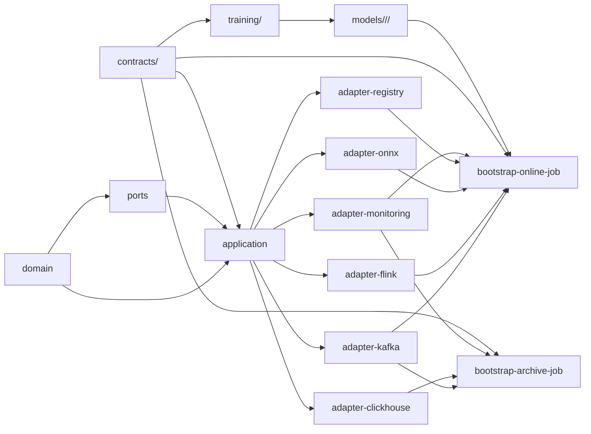

# Repository Structure and First Implementation Step

This document defines the repository layout and build boundaries for the Network Security ML Platform. It is a planning artifact only; no implementation repository is created by this document.

## A. Final Repository Tree

```text
ml-platform/
  .editorconfig
  .env.example
  .gitignore
  README.md
  pom.xml
  mvnw
  mvnw.cmd
  .mvn/
    wrapper/
      maven-wrapper.properties

  contracts/                              # Versioned, language-neutral contracts
    source/
      zeek-conn-source-v1.json
    domain/
      network-event-v1.json
    features/
      conn-feature-schema-v1.json
    stream/
      network-event-v1.json
      feature-vector-v1.json
      prediction-v1.json
      invalid-event-v1.json
      dlq-v1.json
    dataset/
      dataset-manifest-v1.json
    model/
      model-bundle-manifest-v1.json

  modules/                                # Java 11 Maven reactor modules
    domain/
      pom.xml
      src/
        main/java/.../domain/
          event/
          feature/
          inference/
          model/
        test/java/.../domain/
    ports/
      pom.xml
      src/
        main/java/.../port/
          in/
          out/
        test/java/.../port/
    application/
      pom.xml
      src/
        main/java/.../application/
          usecase/
          validation/
          feature/
        test/java/.../application/
    adapter-kafka/
      pom.xml
      src/
        main/java/.../adapter/kafka/
          dto/
          parser/
          mapper/
          source/
          sink/
        test/java/.../adapter/kafka/
    adapter-flink/
      pom.xml
      src/
        main/java/.../adapter/flink/
          state/
          watermark/
          process/
          metrics/
        test/java/.../adapter/flink/
    adapter-onnx/
      pom.xml
      src/
        main/java/.../adapter/onnx/
          loader/
          runtime/
          validation/
        test/java/.../adapter/onnx/
    adapter-clickhouse/
      pom.xml
      src/
        main/java/.../adapter/clickhouse/
          writer/
          mapper/
          batch/
        test/java/.../adapter/clickhouse/
    adapter-registry-filesystem/
      pom.xml
      src/
        main/java/.../adapter/registry/
        test/java/.../adapter/registry/
    adapter-monitoring/
      pom.xml
      src/
        main/java/.../adapter/monitoring/
        test/java/.../adapter/monitoring/
    bootstrap-online-job/
      pom.xml
      src/
        main/java/.../bootstrap/online/
          OnlineInferenceJob.java
        test/java/.../bootstrap/online/
    bootstrap-archive-job/
      pom.xml
      src/
        main/java/.../bootstrap/archive/
          ArchiveJob.java
        test/java/.../bootstrap/archive/

  training/                               # Independent Python project
    pyproject.toml
    README.md
    configs/
      conn-v1-baseline.yaml
    src/netsec_ml/
      dataset/
      features/
      preprocessing/
      training/
      evaluation/
      export/
      registry/
      cli/
    tests/
      unit/
      integration/
      parity/

  config/                                 # Non-secret environment configuration
    development/
      online-job.yaml
      archive-job.yaml
      resources.yaml
    test/
    production/
    flink/
      flink-conf.yaml
    logging/
      logback.xml

  infrastructure/
    clickhouse/
      ddl/
        001_mvp_tables.sql
    kafka/
      topics/
        internal-topics.yaml
    monitoring/
      prometheus.yml
      alerts.yml
      grafana-dashboard.json
    flink/
      state-storage/
        README.md

  docker/
    compose/
      docker-compose.dev.override.yml
    flink/
      Dockerfile
    training/
      Dockerfile
    monitoring/
      README.md

  models/                                 # Runtime volume; artifacts ignored by Git
    .gitignore
    README.md

  scripts/
    setup/
    build/
    test/
    kafka/
    database/
    flink/
    model/
    monitor/
    performance/

  tests/                                  # Cross-module and cross-language tests
    fixtures/
      zeek_conn/
      feature_golden/
      onnx_parity/
      training/
    integration/
    e2e/
    performance/

  docs/
    architecture.md
    local-services.md
    kafka.md
    flink.md
    features.md
    clickhouse.md
    training.md
    inference.md
    model-registry.md
    monitoring.md
    testing.md
    operations.md
    adr/

  artifacts/                              # Ignored benchmark and release evidence
    .gitignore
```

### Major directory purpose

| Directory | Purpose |
|---|---|
| `contracts/` | The immutable shared source of truth for source, feature, stream, dataset, and model interfaces. |
| `modules/` | Java modules implementing Hexagonal Architecture. Domain/application code remains independent from infrastructure. |
| `training/` | Independent CPU-only Python training project. It consumes canonical feature vectors, not raw Zeek parsing logic. |
| `config/` | Non-secret development, test, production, Flink, resource, and logging configuration. |
| `infrastructure/` | Declarative ClickHouse, Kafka, monitoring, and durable Flink-state setup. |
| `docker/` | Development overlays/images; it extends existing local services rather than duplicating Kafka, Flink, or ClickHouse. |
| `models/` | Read-only runtime model mount. Model artifacts are versioned but excluded from Git. |
| `scripts/` | Safe Bash entry points grouped by purpose. |
| `tests/` | Fixtures plus cross-module, E2E, and performance evidence. |
| `docs/` | Living documentation and architecture decision records. |
| `artifacts/` | Ignored benchmark, model-release, and recovery evidence. |

`contracts/` is the shared source of truth. Java/Flink creates canonical `FeatureVector` records; Python consumes those vectors for training and embeds fitted scaling in ONNX. This prevents duplicate preprocessing logic.

## B. Responsibility Map

| Area | Primary owner | Notes |
|---|---|---|
| `modules/domain`, `ports`, `application` | Software Engineer | AI reviews feature semantics and model contracts. |
| Kafka, Flink, ClickHouse adapters and bootstraps | Software Engineer | Infrastructure-specific code remains in adapters. |
| ONNX and registry adapters | Software Engineer | AI owns compatibility and parity requirements. |
| `training/` | AI Engineer | No raw Zeek parser or duplicate feature extractor. |
| Feature/model contracts and fixtures | Shared | AI proposes; both review before merge. |
| Source/stream contracts | Shared | Software implements producer/consumer behavior. |
| Infrastructure, Docker, scripts, monitoring | Software Engineer | AI validates model-resource settings. |
| Feature/training/model documentation | AI Engineer | Operational documentation: Software Engineer. |
| Cross-language parity and E2E tests | Shared | Required before model release. |

## C. Dependency Map



Rules:

- `domain` imports no Kafka, Flink, ClickHouse, ONNX Runtime, Jackson, or Docker classes.
- `application` imports only `domain` and `ports`.
- Adapters implement output ports or drive input ports.
- Bootstrap modules are the only place where concrete adapters are wired together.
- Python depends on contracts and archived feature vectors, never Java classes or raw-event preprocessing.

## D. Build Map

| Component | Build/test approach |
|---|---|
| Java core and adapters | Root Maven reactor: `./mvnw clean verify`. |
| Flink jobs | Maven packages `bootstrap-online-job` and `bootstrap-archive-job` as deployable JARs; Flink dependencies are `provided` where appropriate. |
| Python training | Isolated `training/pyproject.toml`; install in a virtual environment, then run `pytest` and CLI commands. |
| Docker | Compose override extends existing local services rather than duplicating Kafka/Flink/ClickHouse. |
| Unit tests | Live in each Java module and `training/tests/unit`. |
| Integration/E2E tests | Root `tests/integration` and `tests/e2e`; use existing Docker services or disposable test profiles. |
| Performance tests | `tests/performance` plus rate-controlled scripts under `scripts/performance`. |

Initial Java dependencies will be explicit in module POMs:

- Flink 1.17.2: stream processing/runtime.
- Flink Kafka connector compatible with 1.17.2: input/output topics.
- Jackson: Kafka JSON adapter only.
- ONNX Runtime Java: CPU inference adapter only.
- ClickHouse Java client: archive adapter only.
- JUnit 5: Java tests.

Initial Python dependencies will be explicit in `pyproject.toml`:

- `scikit-learn`: CPU logistic-regression baseline.
- `skl2onnx` and `onnxruntime`: export and parity validation.
- ClickHouse client plus Arrow/Parquet tooling: chunked dataset snapshots.
- `pytest`: tests.

## E. Implementation Order

1. Root repository skeleton, Maven reactor, Python project shell, Git/config templates.
2. Canonical contracts and sanitized `conn` fixtures.
3. Pure Java domain values and mapper validation tests.
4. Input/output port interfaces and application use-case boundaries.
5. Kafka DTO/parser/DLQ adapter.
6. Feature schema loader, preprocessor, event-level extractor, golden tests.
7. Flink source, watermarks, bounded rolling state, feature Kafka output.
8. ClickHouse DDL and independent archive job.
9. Python dataset snapshot, quality gates, temporal split.
10. CPU logistic-regression training and ONNX export.
11. Immutable model bundle/registry validation.
12. Java ONNX adapter and Python/Java parity tests.
13. Flink inference and prediction/alert Kafka outputs.
14. Prediction/archive integration and first E2E test.
15. Metrics, logs, dashboards, and runbooks.
16. Load, checkpoint, outage, and recovery tests.
17. Deployment/rollback scripts and clean-environment rehearsal.
18. Final documentation and Day 20 demo evidence.

## F. First Implementation Step

**Step 1: Create only the repository skeleton and build foundations.**

It will include:

- Root Maven parent with empty Java child modules.
- Python `pyproject.toml` shell without ML implementation.
- `.gitignore`, `.editorconfig`, and `.env.example`.
- Empty-but-documented contract, config, infrastructure, Docker, test, script, model, artifact, and documentation directories.
- A minimal `README.md` explaining module boundaries and CPU-only constraints.
- Maven verification that the empty reactor builds successfully.

Definition of Done: `mvn clean verify` succeeds, the tree exists exactly as approved, no secrets are committed, and no infrastructure behavior or feature logic has been implemented yet.

After this structure is approved, the next interactive command is: **Implement step 1**.

