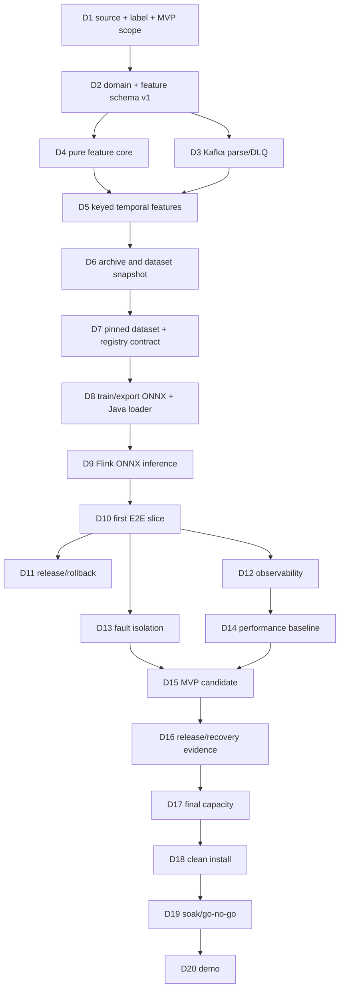

# 20-Day Network Security ML Platform MVP Roadmap

This is an execution plan, not a second architecture exercise. It assumes the existing Docker, Kafka, ClickHouse, Flink, Maven, Java 21, and Python setup is usable, and limits the MVP to the existing external Kafka `conn` topic.

> Calendar note: 20 working days is four five-day delivery blocks, even though the brief calls it three weeks. The final five days are intentionally reserved for integration, performance, recovery, and release evidence.

## Scope locked on Day 1

### The first ML model

Build a **binary logistic-regression baseline** for `suspicious connection` versus `normal connection`, using a labelled dataset agreed on Day 1.

Use a scikit-learn `Pipeline(StandardScaler(), LogisticRegression(...))`, export the entire fitted pipeline with `skl2onnx`, and run the result using ONNX Runtime Java on CPU. Configure export to return a fixed probability tensor, not a map: class ordering is `[normal=0, suspicious=1]`; probability at index `1` is the score.

Why this model:

- It trains quickly on CPU, has a small artifact, and scores in microseconds to low milliseconds for a small vector.
- `StandardScaler` plus logistic regression exports reliably to a simple ONNX graph.
- It proves model packaging, feature-schema checks, parity testing, and CPU inference without concealing platform problems behind a complex model.
- It is interpretable enough to debug feature and label mistakes.

This is a platform baseline, not a claim that logistic regression is the final security detector. A small tree model is a later, measured replacement only if it beats the baseline and passes identical ONNX parity checks.

**Hard gate:** if a labelled source and evaluation definition are not agreed by the end of Day 1, the team still builds the feature-to-ONNX plumbing with a small labelled fixture dataset. The Day 20 demo must then say "platform MVP with synthetic/fixture model", not "validated threat detector".

### `conn-feature-v1`: exactly 20 input features

All model inputs are ordered `float32`; canonical Java/Flink feature preparation emits them. The fitted scaler is inside ONNX. No Python code recalculates them from raw Zeek records.

| Index | Feature | Rule / missing behavior |
|---:|---|---|
| 0 | `duration_ms` | Zeek duration seconds * 1,000; non-negative required |
| 1 | `origin_bytes` | non-negative required |
| 2 | `response_bytes` | non-negative required |
| 3 | `origin_packets` | non-negative required |
| 4 | `response_packets` | non-negative required |
| 5 | `total_bytes` | `origin_bytes + response_bytes` |
| 6 | `total_packets` | `origin_packets + response_packets` |
| 7 | `bytes_per_packet` | `total_bytes / max(1,total_packets)` |
| 8 | `response_origin_byte_ratio` | `response_bytes / max(1,origin_bytes)` |
| 9 | `destination_port` | integer represented exactly as `float32` |
| 10 | `destination_is_well_known` | `1` when port is 1-1023, otherwise `0` |
| 11 | `protocol_tcp` | `1` if TCP, else `0` |
| 12 | `protocol_udp` | `1` if UDP, else `0`; all other protocols have both flags `0` |
| 13 | `service_dns` | `1` if service is DNS, else `0` |
| 14 | `service_http` | `1` if HTTP, else `0` |
| 15 | `service_ssl` | `1` if SSL, else `0` |
| 16 | `connection_failed` | `1` for the documented failed/errored Zeek states, else `0` |
| 17 | `source_connections_5m` | count in fixed prior five one-minute buckets for `(sensor, sourceIp)` |
| 18 | `source_bytes_5m` | byte sum in the same buckets |
| 19 | `source_failed_connections_5m` | failed count in the same buckets |

Unknown service/protocol/state values are mapped as documented above and increment a bounded `unknown_category_total{field}` metric. A missing required numeric field is invalid, goes to `netsec.invalid-event.v1`, and receives no model score. This avoids silently treating missing telemetry as zero traffic.

The feature schema is immutable once released:

```text
id: conn-feature-v1
semanticVersion: 1.0.0
contentHash: SHA-256 of canonical JSON, 64 lowercase hex characters
inputDtype: float32
featureCount: 20
```

Any formula, default, category mapping, order, type, or state-window change creates `conn-feature-v2` and a new model. It does not edit v1 in place.

### Minimum ClickHouse scope

Create only these four tables in `ddl/001_mvp_tables.sql`:

| Table | Required columns | Engine, partition, order | Retention and write path |
|---|---|---|---|
| `network_events` | `event_id`, `event_time`, `ingested_at`, sensor, IPs, ports, protocol/service/state, numeric connection fields, `quality_flags`, `row_version` | `ReplacingMergeTree(row_version)`, daily partition, order `(sensor,event_time,event_id)` | 14 days. Optional investigation audit; archive job batch writes it. |
| `feature_vectors` | event/audit identity, `schema_id`, `schema_hash`, `values Array(Float32)`, `quality_flags`, `row_version` | `ReplacingMergeTree(row_version)`, daily partition, order `(schema_hash,event_time,event_id)` | 90 days. Required training source; archive job batch writes it. |
| `predictions` | `prediction_id`, `event_id`, event time, model name/version/SHA, schema hash, score, decision, threshold, `inference_us`, `row_version` | `ReplacingMergeTree(row_version)`, daily partition, order `(model_name,model_version,event_time,event_id)` | 180 days. Required audit/output archive. |
| `model_metadata` | model name/version/SHA, schema hash, dataset snapshot hash, code hash, threshold, metrics JSON, status, release time | `MergeTree`, order `(model_name,model_version)` | no short TTL. Small release audit record. |

Use `DateTime64(3, 'UTC')`, `IPv6` for IP fields, and `LowCardinality(String)` only for bounded values such as sensor/protocol/service/state. The online job publishes normalized `netsec.network-event.v1`, feature, and prediction records to internal Kafka first. A separate archive job consumes those records and inserts 5,000 rows, 4 MiB, or one second at a time; therefore ClickHouse cannot stop online scoring.

### Fixed implementation boundary

```text
modules/domain                    pure Java values and feature formulas
modules/application               use cases and input/output ports
modules/adapter-kafka             JSON DTO/parser and Kafka record mapping
modules/adapter-flink             watermarks, keyed state, Flink functions
modules/adapter-onnx              ONNX Runtime model loader/inference port
modules/adapter-clickhouse        archive writer only
modules/bootstrap-online-job      composition of the online job
modules/bootstrap-archive-job     composition of the archive job
training/                         Python snapshot/train/export/verify code
contracts/                        immutable source, feature, stream, model contracts
tests/                            fixtures, unit, integration, end-to-end tests
```

## Lightweight operating model

- **Daily synchronization:** 10 minutes at the start of the day: yesterday's evidence, today's task, contract decision needed, blocker. End with one sentence in the pull request or issue tracker; no extra ceremony.
- **Git:** trunk-based for two people. `main` is always runnable. Use short-lived `feat/<area>-<task>` or `fix/<area>-<task>` branches, small conventional commits, one focused pull request, squash merge. The other engineer reviews every shared contract, schema, model bundle, or deployment change. No `develop`, release branch, mandatory stand-ups beyond the 10-minute sync, or approval bureaucracy.
- **Documentation:** create each document when the behavior stabilizes: `README.md`/`architecture.md` in week 1; `kafka.md`, `flink.md`, and `features.md` in week 1; `training.md` and `inference.md` in week 2; `testing.md` and `operations.md` in the final block. A document is part of that day's definition of done, not a Day 20 wish.
- **Parallel rule:** the AI engineer owns feature semantics, fixtures, datasets, training, and ONNX parity. The software engineer owns Java/Flink/Kafka/ClickHouse/deploy/metrics. They synchronize only through committed versioned contracts and golden fixtures.

---

# 1. Three-Week Overview

| Day | AI Engineer | Software Engineer | Shared deliverable |
|---:|---|---|---|
| 1 | Define label/metric and baseline acceptance | Inspect real input and bootstrap repository | Scope, source, and model decision record |
| 2 | Freeze 20-feature v1 contract | Complete DTO/domain/mapper | Versioned domain and feature contracts |
| 3 | Build labelled fixtures and vector oracle | Kafka parse/validation/DLQ pipeline | `conn` record reaches validated domain event |
| 4 | Define preprocessing and expected vectors | Pure Java feature core | Deterministic event-level feature vectors |
| 5 | Specify temporal feature semantics | Flink event time/keyed state | Feature-only online path to Kafka |
| 6 | Define dataset snapshot format | ClickHouse DDL and archive job | Features archive independently of scoring |
| 7 | Profile snapshot and label coverage | Model registry/config foundation | Reproducible training input |
| 8 | Train/export logistic baseline | ONNX Java loader and input adapter | Verified model bundle v1 |
| 9 | Create Python/Java parity corpus | Wire ONNX score and prediction topic | Live Flink prediction path |
| 10 | Evaluate threshold/model card draft | Archive predictions/model metadata | First end-to-end working slice |
| 11 | Harden dataset/quality gates | Savepoint deploy and rollback scripts | Repeatable release procedure |
| 12 | Validate score distribution | Logs, metrics, dashboards | Observable online job |
| 13 | Test feature edge cases/skew | Fault/DLQ/archive-isolation tests | Failure behavior evidence |
| 14 | Define benchmark acceptance | Load generator and first profile | Baseline capacity report |
| 15 | Review model result/limitations | Tune caps and run E2E rehearsal | MVP candidate decision |
| 16 | Train final candidate from pinned snapshot | Recovery drills | Release artifact and recovery evidence |
| 17 | Analyze errors and demo scenarios | Rate tests through 5,000 events/s | Sustainable-rate result |
| 18 | Reproduce export/parity from clean environment | Clean deploy and operations docs | Reproducible deployment evidence |
| 19 | Final ML sign-off or caveat | Soak/fix release blockers | Go/no-go report |
| 20 | Present model evidence | Run live demo and handover | End-to-end MVP demo |

---

# 2. Detailed Day-by-Day Plan

## Week 1 - Foundation and Feature Pipeline

### Day 1 - Freeze business and source assumptions

**AI Engineer**

- Write `docs/model-objective.md`: binary target definition, label source/owner, positive class, label delay, alert action, false-positive cost, and minimum metric. Select a time-based validation split.
- Create `training/configs/conn-v1-baseline.yaml` with model family, deterministic random seed, threshold placeholder, and CPU-only dependency list.
- Draft the 20-feature table above with units, boundaries, and candidate failed connection states.

**Software Engineer**

- Capture 100-1,000 sanitized `conn` records and record actual fields, types, Kafka partition count, timestamp skew, null rates, and event-id uniqueness rate in `docs/kafka.md`.
- Create Maven multi-module skeleton, test profile, Docker environment file template, and configuration names. Move broker endpoint to configuration; do not hardcode credentials or endpoint in Java.
- Add a smoke script that consumes a bounded sample without changing source offsets.

**Shared work / synchronization contract**

- Agree and commit `contracts/source/zeek-conn-source-v1.json`: required fields, optional fields, epoch-second meaning of `DateTime`, source identifier rule, and invalid-record policy.
- Decide whether real labels are available by Day 7. Record the fallback fixture-model limitation if not.

**Deliverables**

```text
docs/model-objective.md
docs/kafka.md
docs/architecture.md
contracts/source/zeek-conn-source-v1.json
training/configs/conn-v1-baseline.yaml
modules/{domain,application,adapter-kafka,adapter-flink,adapter-onnx,adapter-clickhouse,bootstrap-online-job,bootstrap-archive-job}/pom.xml
scripts/consume-conn-sample.sh
```

**Tests**

- Maven test profile executes an empty test suite.
- Sample consumer reads a bounded message set from `conn`.
- Contract validation accepts captured valid fixtures and rejects a missing `id`, bad port, and nonnumeric `DateTime`.

**Definition of Done**

- The two engineers can independently build the repository, inspect the same sanitized input fixtures, and point to one committed source contract and one documented model objective.

### Day 2 - Freeze domain and feature schema v1

**AI Engineer**

- Implement feature contract data in `contracts/features/conn-feature-schema-v1.json`: indices 0-19, names, units, type, formula text, missing policy, and state requirements.
- Create 20 labelled/golden feature cases covering normal TCP, UDP/DNS, zero packets, unknown service, failed connection, and missing numeric input.
- Write the canonical expected-vector oracle in `tests/fixtures/feature_golden/expected-v1.json`; use decimal values that are explicitly cast to float32 expectations.

**Software Engineer**

- Implement immutable domain values: `NetworkEvent`, `ConnectionTuple`, `ConnectionMeasurements`, `ConnectionLocality`, `EventEnvelope`, and enum/value objects for protocol/service/state/port/IP.
- Implement `ZeekConnEvent` as a Jackson DTO and `EventMapper`; mapper converts `DateTime` seconds to UTC millisecond `Instant`, namespaces event IDs with sensor, and retains Kafka metadata only in `EventEnvelope`.
- Add a domain validation result type with reason codes, not uncaught exceptions, for malformed records.

**Shared work / synchronization contract**

- Freeze `contracts/domain/network-event-v1.json` and `conn-feature-v1` together. Agree on exact `OTHER`/`UNKNOWN` category mapping and failed-state list.
- AI can start feature fixtures immediately; software can start mapper/domain immediately. They synchronize only to align fixture field names and validation codes.

**Deliverables**

```text
contracts/domain/network-event-v1.json
contracts/features/conn-feature-schema-v1.json
modules/domain/src/main/java/.../NetworkEvent.java
modules/domain/src/main/java/.../ConnectionTuple.java
modules/domain/src/main/java/.../ConnectionMeasurements.java
modules/adapter-kafka/src/main/java/.../ZeekConnEvent.java
modules/application/src/main/java/.../EventMapper.java
tests/fixtures/feature_golden/{input-v1.jsonl,expected-v1.json}
```

**Tests**

- Mapper tests for a valid sample, epoch conversion, invalid IP/port, missing required count, unknown category, and stable ID.
- Contract test asserts schema feature count is 20, all indices are contiguous, and names are unique.

**Definition of Done**

- A captured JSON message maps to a valid `NetworkEvent`; invalid values return a stable reason code; both schema JSON files are reviewed and content-hashed in the build.

### Day 3 - Make Kafka ingestion safe

**AI Engineer**

- Add `training/tests/test_feature_contract.py` to load the feature schema and prove count/order/type agreement with the golden vector fixture.
- Build `tests/fixtures/training/labelled-conn-v1.parquet` or CSV fixture with a documented fixture-only label; do not use it as a production-quality claim.
- Define label-join keys and label cutoff policy in `docs/training.md`.

**Software Engineer**

- Implement Kafka `byte[]` source, Jackson parser, source-contract validation, mapper call, and `netsec.dlq.v1` side output.
- Add configuration for broker/topic/group ID/start offsets. `conn` is the only input topic.
- Submit a feature-disabled Flink job that writes valid normalized events to the versioned `netsec.network-event.v1` Kafka topic.

**Shared work / synchronization contract**

- Agree on DLQ envelope: source topic/partition/offset, payload hash, reason code, source-contract version, received time; raw payload storage is disabled by default.

**Deliverables**

```text
modules/adapter-kafka/src/main/java/.../{ZeekConnParser,KafkaSourceFactory,DlqRecord}.java
modules/bootstrap-online-job/src/main/java/.../OnlineInferenceJob.java
contracts/stream/{network-event-v1,dlq-v1}.json
scripts/create-topics.sh
training/tests/test_feature_contract.py
docs/training.md
```

**Tests**

- Parser unit tests with malformed JSON and type drift.
- Flink MiniCluster or container integration: valid fixture reaches validated topic; invalid fixture reaches DLQ; job remains running.
- Test config uses a disposable consumer group and never commits production test offsets.

**Definition of Done**

- The real `conn` topic can be consumed by the submitted job, a valid record becomes a domain event, and a malformed record is safely observable without killing the job.

### Day 4 - Implement deterministic event-level features

**AI Engineer**

- Write exact preprocessing rules in `docs/features.md`, including nonnegative validation, duration conversion, division-by-zero behavior, category booleans, quality flags, and the declaration that fitted scaling belongs in ONNX.
- Review/extend golden fixtures so every of the first 17 event-level values has a direct asserted expected result.
- Implement a Python reader that accepts only `float32[20]` vectors; it must not have raw Zeek parsing code.

**Software Engineer**

- Implement pure Java `Preprocessor`, `FeatureDefinition`, `FeatureSchema`, `FeatureVector`, and `EventFeatureExtractor` in domain/application modules.
- Load schema JSON at build/startup, calculate its canonical SHA-256, reject wrong count/order, and ensure emitted values are finite `float32`.
- Keep all functions free of Flink classes so they are normal unit tests.

**Shared work / synchronization contract**

- Compare Java output with the approved golden vectors byte/float-tolerance-for-float32. Any discrepancy changes code or contract before stateful work begins.

**Deliverables**

```text
modules/domain/src/main/java/.../feature/{FeatureDefinition,FeatureSchema,FeatureVector}.java
modules/application/src/main/java/.../{Preprocessor,EventFeatureExtractor,BuildFeaturesUseCase}.java
training/src/netsec_ml/vector_input.py
docs/features.md
tests/.../EventFeatureExtractorTest.java
```

**Tests**

- Golden vector test, schema hash/count test, NaN/infinity rejection, zero-packet division, and unknown-category behavior.
- Python contract test rejects float64, wrong-length, or missing schema hash inputs.

**Definition of Done**

- For all Day 2 fixtures, Java emits the approved `FeatureVector(schemaId, schemaHash, float32[20])` without Flink or Kafka dependencies.

### Day 5 - Add bounded temporal features in Flink

**AI Engineer**

- Specify `SourceWindowState` semantics: key `(sensor, sourceIp)`, five prior one-minute buckets, inclusion boundary, reset after inactivity, bounded disorder allowance of five seconds, and quality flags for late/overflow records.
- Add ordered/out-of-order/late inputs and expected temporal values to golden fixtures.
- Define acceptance values for source timestamp skew and unknown-category rate in `docs/features.md`.

**Software Engineer**

- Implement Flink watermark strategy (five-second disorder, 30-second idleness), `keyBy(SourceKey)`, bounded reorder buffer, and fixed-size rolling-bucket `KeyedProcessFunction`.
- Use EmbeddedRocksDB state backend with a 2 GiB managed-memory cap and 30-minute state TTL. Do not use unbounded `MapState`, distinct-IP sets, or event-history lists.
- Continue publishing normalized events to `netsec.network-event.v1`; publish versioned feature records to `netsec.feature-vector.v1`; retain invalid/late/overflow side outputs.

**Shared work / synchronization contract**

- Freeze window boundaries and tie-breaker `(eventTime,eventId)`. This is part of `conn-feature-v1`, not an implementation detail.

**Deliverables**

```text
modules/domain/src/main/java/.../feature/SourceWindowState.java
modules/adapter-flink/src/main/java/.../{FeatureWatermarks,FeatureProcessFunction,SourceKey}.java
contracts/stream/feature-vector-v1.json
tests/fixtures/feature_golden/{out-of-order-v1.jsonl,late-v1.jsonl}
docs/flink.md
```

**Tests**

- MiniCluster tests prove ordered and bounded-out-of-order sequences create expected vectors.
- Late records and full reorder buffer go to invalid output and do not mutate current window state.
- Checkpoint/restart test restores source state and produces no changed feature schema/hash.

**Definition of Done**

- A running online job consumes `conn`, creates event-level and source-window features, and publishes `netsec.feature-vector.v1` without an ONNX dependency.

## Week 2 - Storage, Training, and ONNX Serving

### Day 6 - Persist the training lineage asynchronously

**AI Engineer**

- Define `dataset-manifest-v1.json`: feature schema hash, source table/query, deduplication rule, event-time bounds, label revision, row count, checksum, and creation code commit.
- Implement chunked ClickHouse feature-vector reader and a snapshot command that writes Parquet plus manifest. It must never materialize the full dataset in a pandas dataframe.
- Inspect first archived data: field missing rates, feature min/max/quantiles, label coverage, class balance, and duplicate event rate.

**Software Engineer**

- Add `ddl/001_mvp_tables.sql`, ClickHouse migration runner, and internal topics `netsec.network-event.v1`, `netsec.feature-vector.v1`, `netsec.prediction.v1`, `netsec.alert.v1`, `netsec.invalid-event.v1`, `netsec.dlq.v1`.
- Implement the independent archive job: Kafka source -> route normalized-event/feature/prediction records -> bounded ClickHouse batch writer. Commit consumer progress only after successful insert acknowledgement; expect duplicates after failures.
- Configure retention/TTLs, use `DateTime64(3,'UTC')`, and expose batch size/latency metrics.

**Shared work / synchronization contract**

- Agree on `feature-vector-v1` stream fields and stable archive row identity. Training snapshot SQL must deduplicate a feature row by `(event_id,schema_hash)` using documented `argMax(..., row_version)` logic.

**Deliverables**

```text
ddl/001_mvp_tables.sql
modules/bootstrap-archive-job/src/main/java/.../ArchiveJob.java
modules/adapter-clickhouse/src/main/java/.../{ClickHouseBatchWriter,ArchiveRouter}.java
training/src/netsec_ml/{snapshot.py,clickhouse_reader.py}.py
contracts/dataset/dataset-manifest-v1.json
docs/clickhouse.md
```

**Tests**

- Containers integration: one feature Kafka event appears in `feature_vectors`.
- Simulated archive writer retry produces an allowed duplicate; snapshot query returns one deterministic latest row.
- Stop ClickHouse and prove the online feature job continues publishing to Kafka while archive lag grows.

**Definition of Done**

- A versioned feature vector is both observable in Kafka and queryable in ClickHouse; ClickHouse failure cannot stop feature production.

### Day 7 - Create reproducible training input and registry base

**AI Engineer**

- Generate the first immutable training snapshot from ClickHouse and commit only its manifest, not potentially sensitive data.
- Implement temporal train/validation/test split by event time; assert no overlap of event IDs and no future data in training folds.
- Add quality gates: minimum row count, valid feature-vector rate, label coverage, class counts, and no NaN/Inf values.

**Software Engineer**

- Implement filesystem `ModelRegistryPort` and strict deployment configuration with `modelName`, exact `modelVersion`, expected manifest SHA-256, model root path, and feature schema hash.
- Create read-only runtime model-volume configuration and bootstrap check that a `latest` alias is rejected.
- Add local scripts to create a durable checkpoint/savepoint directory; do not use a TaskManager container filesystem.

**Shared work / synchronization contract**

- Agree on model bundle layout, immutable model-version naming, model manifest fields, and which dataset/feature/model hashes must appear in every prediction.

**Deliverables**

```text
training/src/netsec_ml/{dataset.py,quality_gates.py,split.py}.py
training/manifests/<snapshot-id>.json
contracts/model/model-bundle-manifest-v1.json
modules/adapter-registry-filesystem/src/main/java/.../FilesystemModelRegistry.java
config/online-job.example.yaml
scripts/create-state-storage.sh
```

**Tests**

- Snapshot test checks checksum/row count and deduplication query.
- Split test proves timestamps and IDs do not leak from validation/test into train.
- Registry unit tests reject missing bundle, mutable `latest`, wrong manifest SHA, and wrong schema hash.

**Definition of Done**

- A model training run has one pinned, auditable input manifest and the online job can resolve only an exact immutable bundle version.

### Day 8 - Train and export the CPU baseline

**AI Engineer**

- Implement `train.py`, `evaluate.py`, and `export_onnx.py` using the pinned snapshot. Limit threads explicitly (`OMP_NUM_THREADS`, BLAS, and estimator settings) to the training CPU budget.
- Train `StandardScaler + LogisticRegression`; save metrics, confusion matrix, precision/recall, ROC-AUC/PR-AUC where meaningful, threshold-selection rule, and model coefficients.
- Export a full ONNX pipeline that accepts `[batch,20] float32`, emits fixed `label` and `probabilities` outputs, and writes `model-manifest.json`, `evaluation.json`, copied feature schema, and SHA-256 sums.

**Software Engineer**

- Add ONNX Runtime Java dependency compatible with Java 21/Flink packaging and implement `OnnxModelLoader` / `OrtInferenceEngine` behind `InferencePort`.
- In a Java test, load the artifact in `open()`-equivalent code, validate manifest/schema/type/shape/output names, set ONNX intra/inter-op threads to 1, and close tensors/results correctly.
- Do not yet wire it into the streaming job; make the loading contract independently testable.

**Shared work / synchronization contract**

- Freeze model manifest fields: `modelVersion`, artifact/model/manifest SHA, feature ID/hash/count, input name/shape/type, output names, class index, threshold, metrics, dataset snapshot hash, code/dependency lock hashes.

**Deliverables**

```text
training/src/netsec_ml/{train,evaluate,export_onnx}.py
training/model_cards/conn-risk-v1.md
models/conn-risk/<version>/{model.onnx,model-manifest.json,feature-schema.json,evaluation.json,sha256sums.txt}
modules/adapter-onnx/src/main/java/.../{OnnxModelLoader,OrtInferenceEngine}.java
```

**Tests**

- Python tests prove exported graph has input `float32[*,20]` and probability output `[*,2]`.
- Java tests reject wrong schema/count/SHA/output name and successfully run a fixture vector.
- Training is repeatable with same input/seed within a documented tolerance.

**Definition of Done**

- One immutable ONNX bundle can be loaded by the Java runtime, not merely by Python, and its provenance is complete.

### Day 9 - Wire CPU ONNX inference into Flink

**AI Engineer**

- Create a 10,000-vector parity corpus sampled from the pinned snapshot plus edge fixtures, with expected Python scores/labels in `tests/fixtures/onnx_parity/`.
- Set an initial threshold from the agreed validation metric; document why it is not tuned on the test set.
- Add model-input tests that reject wrong feature schema hash, wrong vector length, NaN, and unexpected class ordering.

**Software Engineer**

- Add the inference operator after the feature process function. It loads the pinned bundle once per scoring subtask in `open()`, creates `[1,20]` float32 input, executes one-record CPU inference, and emits `Prediction`.
- Create Kafka sinks for `netsec.prediction.v1` and `netsec.alert.v1`; prediction ID is stable hash of `(eventId,modelVersion)`. Alert emission is threshold-driven and contains no raw feature vector by default.
- Propagate model version/SHA/schema hash and inference microseconds into each prediction; fail job startup if model validation fails.

**Shared work / synchronization contract**

- Agree on `contracts/stream/prediction-v1.json`, score meaning, threshold behavior, decision values, and exact output tensor selection.

**Deliverables**

```text
contracts/stream/prediction-v1.json
modules/domain/src/main/java/.../inference/{Prediction,ModelMetadata}.java
modules/adapter-flink/src/main/java/.../OnnxInferenceProcessFunction.java
modules/adapter-kafka/src/main/java/.../PredictionKafkaSink.java
tests/fixtures/onnx_parity/{vectors.npy,expected_scores.json}
```

**Tests**

- Python-versus-Java ONNX parity over 10,000 vectors within an agreed numeric tolerance.
- MiniCluster test: feature fixture -> prediction topic with expected schema/model/version fields.
- Deliberately wrong model schema fails before source consumption.

**Definition of Done**

- A real `conn` message can produce a versioned CPU ONNX prediction in the online Flink job without any remote model call.

### Day 10 - Complete the first end-to-end slice

**AI Engineer**

- Review baseline metrics, feature distributions, coefficient signs/magnitudes, class balance, and top false-positive/false-negative examples. Record limitations in the model card.
- Add a release-check script that refuses an ONNX bundle lacking parity evidence, schema match, snapshot manifest, or evaluation file.

**Software Engineer**

- Extend archive job to write `network_events`, `predictions`, and `model_metadata`; preserve bounded batches and idempotent archive IDs.
- Add model-release insertion only after bundle validation; never use ClickHouse as the model artifact store.
- Create a single command that starts services, applies DDL, submits online/archive jobs, and waits for readiness.

**Shared work / synchronization contract**

- Run a first jointly observed path: fixture Kafka record -> feature vector -> ONNX prediction -> Kafka prediction -> ClickHouse audit rows. Capture IDs at each hop.

**Deliverables**

```text
modules/adapter-clickhouse/src/main/java/.../{PredictionArchiveWriter,ModelMetadataWriter}.java
scripts/{apply-ddl.sh,submit-mvp.sh,verify-e2e.sh}
training/scripts/verify-model-release.py
docs/inference.md
tests/e2e/test_conn_to_prediction.py
```

**Tests**

- Container E2E test validates one event's event ID, feature schema hash, model version, score, and prediction ID through every stage.
- Reprocessing the same input does not create a different logical prediction ID.

**Definition of Done**

- The complete thin slice works on a clean local environment. This is the first meaningful checkpoint; no new source topic or feature is added after it without an explicit trade-off.

## Week 3 - Operational Hardening and Performance Evidence

### Day 11 - Make releases and datasets repeatable

**AI Engineer**

- Make training invocation one command from dataset manifest to model bundle. Persist package lock, random seed, snapshot ID, feature hash, and metric gate in the release output.
- Define release acceptance values for the labelled use case and a clear "do not promote" result. Update `training.md` and model card.

**Software Engineer**

- Configure externalized durable checkpoints/savepoints, failure-rate restart strategy, and the pinned model deployment configuration.
- Implement `scripts/deploy-model-version.sh` and `scripts/rollback-model-version.sh`: savepoint, config change to exact version/SHA, submit, readiness verification, then output smoke check.
- Do not implement in-place hot reload.

**Shared work / synchronization contract**

- Rehearse the release checklist using the same model bytes, manifest SHA, schema hash, and training snapshot in all records.

**Deliverables**

```text
training/scripts/train-release.py
docs/model-release-checklist.md
scripts/{deploy-model-version.sh,rollback-model-version.sh}
config/flink-conf.yaml
docs/runbooks/model-rollback.md
```

**Tests**

- Run release twice from one snapshot; prove manifest provenance is stable apart from documented release timestamp.
- Savepoint/redeploy succeeds with a valid bundle and fails cleanly with incompatible schema.
- Rollback to previous bundle produces prediction records with the prior model version.

**Definition of Done**

- Releasing or rolling back a model is a documented, repeatable command sequence, not a manual file copy or mutable `latest.onnx` change.

### Day 12 - Add lightweight, useful observability

**AI Engineer**

- Define score histogram buckets, prediction/alert-rate expected ranges, invalid-feature reason codes, and label-free drift indicators. Do not add IP or event IDs as metric labels.
- Add a daily feature-data-quality report from ClickHouse: null/invalid, unknown category, min/max, percentile, and decision-rate changes.

**Software Engineer**

- Emit structured logs with event/prediction ID, stage, reason code, schema hash, model version, and inference time; redact raw payload/IP information by default.
- Add bounded-cardinality metrics for Kafka records/lag, Flink in/out/backpressure/checkpoints/state, feature errors, ONNX latency/errors, prediction count, archive batch/retry/latency, CPU/RAM.
- Configure existing resource scripts plus Prometheus/Grafana/Alertmanager only if already easily available; otherwise provide Prometheus text metrics and one documented dashboard import. No ELK/APM.

**Shared work / synchronization contract**

- Agree alert thresholds: repeated checkpoint failure, sustained growing Kafka lag, model load/inference error, invalid-event-rate spike, archive lag, disk/RAM threshold, and p99 inference breach.

**Deliverables**

```text
modules/adapter-observability/src/main/java/.../{Metrics,StructuredLog}.java
monitoring/{prometheus.yml,grafana-dashboard.json,alerts.yml}
training/src/netsec_ml/data_quality_report.py
docs/operations.md
```

**Tests**

- Test metric names/tags stay bounded and no event ID/IP is a label.
- Trigger a deliberately invalid event and model mismatch in test to confirm log/metric/alert paths.
- Verify dashboard shows record flow, checkpoint health, model version, and archive lag.

**Definition of Done**

- An operator can see whether input, feature extraction, inference, or ClickHouse archive is unhealthy without reading source code.

### Day 13 - Prove error isolation and recovery behavior

**AI Engineer**

- Add feature/property tests for extreme values, missing fields, unknown categories, equal timestamps, out-of-order events, and late events. Confirm invalid paths never get a model score.
- Review error samples and adjust only documented reason codes/fixtures, not feature semantics.

**Software Engineer**

- Run controlled faults: malformed JSON, Kafka consumer reconnect, ClickHouse stop/start, archive retry, invalid model deployment, TaskManager restart, and checkpoint failure simulation.
- Verify online predictions continue during ClickHouse outage; archive job alone accumulates and then drains lag.
- Add short operational runbooks for Kafka lag, checkpoint failure, archive lag, and model load failure.

**Shared work / synchronization contract**

- Agree incident disposition: DLQ vs invalid-event vs fail deployment vs retry. No class of error should be silently swallowed.

**Deliverables**

```text
tests/integration/{test_faults.py,test_checkpoint_restore.py}
docs/runbooks/{kafka-lag.md,checkpoint-failure.md,archive-lag.md,model-load-failure.md}
tests/fixtures/feature_golden/extremes-v1.jsonl
```

**Tests**

- Fault matrix records expected result for each condition above.
- TaskManager restart restores from durable checkpoint and retains feature schema/model pin.
- ClickHouse outage test verifies no scoring outage and expected archive consumer lag.

**Definition of Done**

- Known failure modes have observable, tested, bounded behavior and a runbook; there is no promise of unsupported high availability.

### Day 14 - Establish a measured performance baseline

**AI Engineer**

- Define benchmark input distribution: representative feature categories, timestamp disorder, key cardinality, label mix, and record-size profile. Provide a fixed fixture/replay seed.
- Measure Python model training time, artifact size, and Java ONNX score time on the parity corpus; document model-side limits.

**Software Engineer**

- Implement `scripts/replay-conn-load.py` or a Java generator to produce valid `conn` records at controlled rates without touching production source topics.
- Run 100, 500, 1,000, and 5,000 events/s steps for enough time to observe checkpoints. Record throughput, end-to-end p50/p95/p99 latency, CPU, RSS, Kafka lag, Flink busy/backpressure, state bytes, ONNX latency, ClickHouse batch latency and archive lag.
- Test initial parallelism 1, 2, and 4; ONNX threads remain 1. Stay inside 8 CPU/32 GiB container caps.

**Shared work / synchronization contract**

- Agree a sustainable-rate definition: highest rate held for 30 minutes with stable lag, no checkpoint failures, p99 latency under the agreed SLO, CPU below 80% sustained, RAM/disk below 70%, and no growing state/queue.

**Deliverables**

```text
scripts/replay-conn-load.py
tests/fixtures/load/conn-template-v1.json
docs/performance-baseline.md
artifacts/benchmarks/day14-{100,500,1000,5000}eps.json
```

**Tests**

- Rate generator validates every emitted record against source contract.
- Each rate run includes one checkpoint/restart observation and produces metrics artifact.

**Definition of Done**

- The team has measurements, not guesses, for the sustainable MVP rate and a documented bottleneck at any failed rate.

### Day 15 - Consolidate the MVP candidate

**AI Engineer**

- Compare model quality and feature/score distributions against Day 10. Decide whether the baseline meets the agreed label gate; write explicit limitation/fallback statement if it does not.
- Freeze the candidate training snapshot/model version and update the model card, training guide, and known-issues list.

**Software Engineer**

- Apply only measured performance configuration changes: parallelism, Kafka batch/linger, archive batch cap, checkpoint parameters, RocksDB memory, container CPU/RAM limits. Do not tune by superstition.
- Run clean end-to-end rehearsal using deployment scripts, DDL, exact model version, and monitoring dashboard.

**Shared work / synchronization contract**

- Hold a 30-minute scope review. Every unfinished idea is either a release blocker with owner/date or `POSTPONE`; no feature expansion is allowed.

**Deliverables**

```text
docs/mvp-candidate.md
docs/known-limitations.md
config/online-job.yaml
artifacts/benchmarks/mvp-candidate.json
```

**Tests**

- Clean-environment E2E rehearsal passes.
- Performance configuration reproduces a chosen Day 14 sustainable rate.
- Model release checklist and dashboard are complete.

**Definition of Done**

- There is one named MVP candidate with pinned configuration, model, schema, benchmark evidence, and a short list of real residual risks.

## Final Week - Release Evidence and Demo

### Day 16 - Produce release and recovery evidence

**AI Engineer**

- Retrain the candidate exactly from the pinned snapshot, run export/parity/quality gates, and publish a final immutable bundle only if all gates pass.
- Independently reproduce the bundle metadata from a clean Python environment and compare input/output manifest hashes.

**Software Engineer**

- Execute recovery drills against the candidate: TaskManager restart, JobManager/job resubmission from savepoint, archive outage/recovery, and invalid bundle rejection.
- Record recovery time, replay/duplicate behavior, checkpoint location, and required manual steps in operations documentation.

**Shared work / synchronization contract**

- Cross-check every release identifier: dataset snapshot hash -> feature schema hash -> model artifact/manifest SHA -> deployment config -> prediction audit fields.

**Deliverables**

```text
models/conn-risk/<final-version>/...
artifacts/release/<final-version>-evidence.json
artifacts/recovery-drill-results.md
docs/operations.md
```

**Tests**

- Final model passes 10,000-vector parity in Java ONNX Runtime.
- Each recovery drill has a pass/fail record; no model/schema fallback is permitted.

**Definition of Done**

- The release can be reproduced, deployed, and recovered from documented artifacts rather than engineer memory.

### Day 17 - Determine actual capacity and demo load profile

**AI Engineer**

- Review false positives/negatives from representative labelled data and select three non-sensitive demo scenarios: normal, suspicious/alert, and invalid/late event.
- Confirm the final threshold/label statement and prepare a one-page model limitations summary.

**Software Engineer**

- Re-run progressive rates against the final configuration; hold the sustainable rate for 30 minutes and run 5,000 events/s only as a stress point, not a required target.
- Capture Docker CPU/RAM, Kafka lag, Flink backpressure/checkpoints/state, ONNX p99, ClickHouse insert latency, and archive lag. Fix only measured release blockers.

**Shared work / synchronization contract**

- Agree the performance claim wording: measured sustainable rate, hardware/container caps, input profile, and what has not been proven.

**Deliverables**

```text
artifacts/benchmarks/final-capacity-report.md
demo/{normal.json,suspicious.json,invalid-or-late.json}
docs/model-limitations.md
```

**Tests**

- Demo payloads pass the expected normal/alert/DLQ assertions.
- Sustained-rate report includes all required metrics and stays inside 8 CPU/32 GiB limits.

**Definition of Done**

- The team can truthfully state a measured capacity and show a predictable outcome for three demonstration events.

### Day 18 - Rehearse clean installation and handover

**AI Engineer**

- From a clean Python environment, execute snapshot-to-model release instructions exactly as documented. Fix missing dependencies or undocumented manual actions.
- Finalize `docs/training.md`, `docs/inference.md`, model card, and feature schema explanation.

**Software Engineer**

- From a clean Docker/working directory state, run service bootstrap, DDL, topic creation, model-volume configuration, job submission, readiness, and E2E verification using scripts only.
- Finalize `README.md`, `local-services.md`, `kafka.md`, `flink.md`, `testing.md`, and operations runbooks.

**Shared work / synchronization contract**

- Each engineer performs the other's documented handoff at least once: AI follows deployment verification; software follows model verification. Record defects as blockers.

**Deliverables**

```text
README.md
docs/{local-services,kafka,flink,features,training,inference,testing,operations}.md
scripts/{bootstrap-local.sh,verify-e2e.sh}
artifacts/clean-install-checklist.md
```

**Tests**

- Clean install completes without source edits or hidden local files.
- The complete E2E verification command passes after clean startup.

**Definition of Done**

- A competent teammate can build, deploy, train/export, and verify the MVP from the repository documentation.

### Day 19 - Soak, triage, and go/no-go

**AI Engineer**

- Monitor the soak output for score collapse, unexpected class/decision distribution, invalid vectors, and feature distribution anomalies. Update limitations only with evidence.
- Verify all final model metadata rows and prediction audit fields are correct in ClickHouse.

**Software Engineer**

- Run a representative-rate soak for at least two hours where practical. Watch checkpoint duration/failures, lag, state growth, memory, disk, Docker restarts, archive lag, and insert errors.
- Triage only P0/P1 release blockers. `POSTPONE` cosmetic refactors, extra topics, new features, dashboard polish, and model improvements.

**Shared work / synchronization contract**

- Conduct a 30-minute go/no-go review against the MVP Definition of Done below. Assign an explicit owner and fallback for every unmet item.

**Deliverables**

```text
artifacts/soak-test-report.md
docs/go-no-go.md
docs/post-mvp-backlog.md
```

**Tests**

- Soak report shows no unexplained restart, unbounded lag/state, or resource-cap breach at the reported sustainable rate.
- A repeat of the full E2E test succeeds after the soak.

**Definition of Done**

- Either the MVP is demonstrably ready or the remaining release blocker is explicitly stated; no ambiguity is carried into the demo.

### Day 20 - Demonstrate and hand off the MVP

**AI Engineer**

- Present model objective, labels/data snapshot provenance, feature v1 list, baseline evaluation, ONNX parity evidence, threshold, and known limitations.
- Show that the demo's suspicious connection produces a score/decision consistent with the published model contract. Do not overclaim detection quality beyond the evaluation evidence.

**Software Engineer**

- Run the live end-to-end demo, show online job/model/schema readiness, Kafka input/output, Flink metrics, ClickHouse feature/prediction rows, and dashboard resource/latency views.
- Demonstrate one safe failure behavior: malformed/late record to DLQ or archive outage while online predictions continue. Show rollback command/output if time permits.

**Shared work / synchronization contract**

- Archive source code, model bundle/version, schema, deployment config, benchmark report, model card, runbooks, and known backlog as the MVP release evidence.

**Deliverables**

```text
artifacts/mvp-release-manifest.json
demo/day20-demo-script.md
docs/post-mvp-backlog.md
git tag mvp-v1.0.0
```

**Tests**

- Run `scripts/verify-e2e.sh` in front of the team: Kafka event -> Flink -> versioned FeatureVector -> ONNX Prediction -> Kafka output -> ClickHouse row.
- Verify normal, suspicious, and invalid/late scenario assertions; show model/schema/version identity in output.

**Definition of Done**

- The team has a reproducible CPU-only real-time ML platform MVP, a demonstrated end-to-end path, recovery/benchmark evidence, and an honest limitation statement.

---

# 3. Dependency Graph



Critical path: source/feature contract -> canonical feature pipeline -> archive/snapshot -> model bundle -> Flink inference -> first E2E -> benchmark/recovery -> demo. Do not start stateful features or model export before the v1 feature contract and golden vectors are frozen.

---

# 4. Parallel Work Map

| Period | AI Engineer can work independently | Software Engineer can work independently | Exact synchronization point |
|---|---|---|---|
| Days 1-2 | Objective, labels, feature draft, fixtures | Repository, source inspection, domain values, DTO | `zeek-conn-source-v1`, `network-event-v1`, `conn-feature-v1` field/type/default decisions |
| Days 3-5 | Golden vectors, label fixtures, state semantics | Parser/DLQ, Flink source, pure feature implementation, watermark/state driver | Java output matches golden vectors; window/tie/late semantics frozen |
| Days 6-7 | Snapshot code, data profiling, split/quality gates | DDL, archive job, registry/config, checkpoint storage | Feature stream fields, CH row identity/deduplication, model bundle manifest |
| Days 8-10 | Training/export, evaluation, parity corpus | Java ONNX loader, Flink operator, prediction/archive sinks | ONNX input/output/class-index/threshold and prediction-v1 contract |
| Days 11-13 | Release quality gates, data quality metrics, edge fixtures | Deployment/rollback, metrics, dashboard, fault drills | Release checklist, alert thresholds, failure disposition table |
| Days 14-20 | Model-side benchmark/limitations, final release, demo examples | Load/recovery/soak, scripts/docs, demo operation | Sustainable-rate claim, go/no-go evidence, final demo script |

Rules that protect parallelism:

1. A shared contract is committed before its consumer starts integrating.
2. Golden fixtures, not verbal expectations, are the handoff between feature definitions and Java implementation.
3. The AI engineer never adds a raw-event preprocessor to Python. The software engineer never changes feature order/defaults without a feature-schema review.
4. A model bundle cannot be merged unless the Java ONNX parity test is green.

---

# 5. Integration Contracts to Freeze Together

| Contract | Owner | Freeze day | Required fields / rules |
|---|---|---:|---|
| `zeek-conn-source-v1` | Both; software implements parser | 1 | Required JSON fields/types, `DateTime` epoch seconds, ID/sensor policy, additive-field policy, invalid reason codes |
| `network-event-v1` | Both; software owns domain | 2 | Event ID/time, typed tuple/measurements/locality, no Kafka DTO in domain, invalid values and category representation |
| `conn-feature-v1` | AI owns semantics; software owns execution | 2, window semantics 5 | 20 ordered float32 values, content hash, units/formulas/defaults, category mapping, window/key/watermark/tie behavior |
| `dlq-v1` and `invalid-event-v1` | Software with AI reason-code review | 3/5 | IDs, source metadata/hash, stage, bounded reason code; never unbounded raw payloads |
| `feature-vector-v1` | Both | 5/6 | Event identity/time, schema ID/hash, exactly 20 float32 values, quality flags; immutable archive identity |
| Dataset manifest v1 | AI owns; software reviews CH query | 6 | source query/dedup rule, schema hash, time range, label revision, checksum, code version |
| Model bundle manifest v1 | Both | 7/8 | exact version/SHA, schema ID/hash/count, ONNX input/output, class index, threshold, snapshot/code/dependency hashes, metrics |
| `prediction-v1` | Both | 9 | deterministic prediction ID, model/schema identity, score/decision/threshold, inference time, quality flags |
| Deployment config | Software owns; AI approves model identity | 11 | exact model version + manifest SHA, schema hash, topic/config settings, checkpoint location; no `latest` |

---

# 6. MVP Definition of Done

All items below must be true on Day 20:

- [ ] External Kafka `conn` records are consumed with versioned configuration and safe parse/domain validation.
- [ ] Invalid JSON, missing required values, invalid timestamps, late/overflow state events, and invalid feature vectors go to observable error outputs without crashing the online job.
- [ ] The domain remains independent of Kafka, Flink, ClickHouse, and ONNX dependencies.
- [ ] `conn-feature-v1` has exactly 20 ordered float32 features, a content hash, golden vectors, fixed event-time/window semantics, and no duplicate Python extractor.
- [ ] Feature vectors and predictions are published to versioned Kafka topics; ClickHouse archive outage does not stop online predictions.
- [ ] ClickHouse contains the four MVP tables, batch writes, stated TTLs, and snapshot deduplication logic.
- [ ] Python trains a CPU-only logistic baseline from an immutable feature-vector snapshot and produces an immutable ONNX bundle.
- [ ] Java ONNX Runtime validates model/schema/hash/input/output at startup and scores in-process without a network call.
- [ ] Python and Java ONNX outputs match across 10,000 fixed vectors within the documented tolerance.
- [ ] Each prediction records stable prediction ID, feature schema hash, model version/SHA, score, threshold, decision, and inference latency.
- [ ] Checkpoint/savepoint storage is durable; model release/rollback and at least one recovery drill have been executed.
- [ ] Metrics/logs/dashboards show resource health, Kafka lag, Flink flow/checkpoints/state, feature errors, inference latency/errors, prediction rate, ClickHouse archive status, and model/schema version.
- [ ] A benchmark report states sustainable rate and measured p50/p95/p99 latency/CPU/RAM/lag/state/insert metrics under 8 CPU/32 GiB caps.
- [ ] Clean setup, E2E verification, feature/model docs, operations runbooks, model card, and known limitations are present and tested.

---

# 7. Risk Register

| Risk | Early signal | Mitigation / owner | Release effect |
|---|---|---|---|
| No reliable labels or target definition | No label owner by Day 1; low coverage by Day 7 | AI documents fixture-only fallback, data collection plan, and no-production-ML claim | Platform can ship; validated detector cannot |
| Input schema/timestamps drift | DLQ/type errors or high skew/late rate | Software owns source contract, metrics, fixtures, bounded watermarks | Pause model promotion; fix contract/version |
| Training-serving skew | Vector/parity differences; schema mismatch | Feature hash, Java-only canonical extraction, golden corpus, release gate | Release blocker |
| Stateful IP cardinality grows | RocksDB/state bytes rise; TTL cleanup insufficient | Fixed buckets only, cap reorder buffer, monitor active keys; reduce TTL/scale after evidence | Capacity blocker if cap breached |
| ONNX conversion/output incompatibility | Java load or parity fails | Use logistic baseline, fixed tensor export, Java validation on Day 8 | Model blocker; platform work continues |
| ClickHouse slows/fails | Archive lag/retries/insert latency | Separate archive job, Kafka retention, bounded batch queue | No online outage; archive recovery required |
| CPU oversubscription/backpressure | High p99, CPU >80%, lag/backpressure grows | Four subtasks, ORT threads=1, progressive benchmark | Lower sustainable rate; no unmeasured scale claim |
| Two-person integration bottleneck | Long-lived branches, undocumented handoffs | Daily 10-min sync, contract PR review, thin slice on Day 10 | Cut scope before adding features |
| Sensitive telemetry retention | Raw IP/payload in logs/data, unclear TTL | Least privilege, log redaction, small TTLs, no raw DLQ payload default | Security sign-off blocker |

---

# 8. What We Explicitly Do NOT Build

The following are **POSTPONE** items. Adding them during the 20 days is a scope failure unless they replace an existing task.

- **POSTPONE:** DNS, HTTP, SSL, SSH, files, Diameter, NTP, and multi-topic feature joins. MVP is `conn` only.
- **POSTPONE:** Hundreds of features, exact distinct destination counting, per-destination/pair graph state, reputation feeds, and retained per-event histories.
- **POSTPONE:** Neural networks, deep packet inspection models, GPU/CUDA/TensorRT, distributed hyperparameter search, and many parallel model candidates.
- **POSTPONE:** Kubernetes, MLflow, Feast, a dedicated feature store, an online feature database, a remote model-serving service, and a schema-registry migration.
- **POSTPONE:** Model canaries, A/B routing, in-place model hot reload, multi-model ensembles, and dynamic model selection.
- **POSTPONE:** Full Flink JobManager HA, multi-cluster/disaster recovery, cross-region replication, and a complex alert case-management system.
- **POSTPONE:** ELK/Splunk-scale observability or distributed tracing. Structured logs plus focused Prometheus/Grafana metrics are sufficient.
- **POSTPONE:** Perfect exactly-once ClickHouse inserts. Archive writes are idempotent/deduplicated; exactly-once focus stays on Kafka-to-Kafka output where supported.

---

# 9. Day 20 Demo Script

The demo proves architecture, correctness controls, and operational evidence - not unvalidated intrusion-detection accuracy.

1. Show the current deployment configuration naming the exact `conn-feature-v1` hash and immutable model version/manifest SHA.
2. Show readiness: online Flink job running, model loaded, last checkpoint, archive job status, and dashboard baseline.
3. Produce a normal `conn` fixture to the demo input topic. Show its Kafka key/ID, feature-vector record with schema hash, prediction with model version, and ClickHouse `feature_vectors`/`predictions` rows.
4. Produce the agreed suspicious fixture. Show the score, class-1 probability, threshold decision, `netsec.alert.v1` record, and matching ClickHouse audit identity.
5. Produce a malformed or deliberately late fixture. Show it in `netsec.dlq.v1` or `netsec.invalid-event.v1` with reason code while the online job remains healthy.
6. Stop ClickHouse or pause the archive job briefly. Show predictions continue on Kafka and archive lag increases; restore it and show the archive catches up.
7. Show Java/Python ONNX parity report, the feature schema, dataset manifest/model card, and final capacity report under the 8 CPU/32 GiB runtime cap.
8. End with the model limitation statement, recovery/rollback command, and the explicit POSTPONE backlog.

The final proof is a repeatable command: `scripts/verify-e2e.sh` must assert `Kafka event -> Flink -> FeatureVector -> ONNX Prediction -> Kafka output -> ClickHouse` using IDs, schema hash, and model version captured at every stage.
